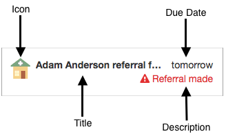
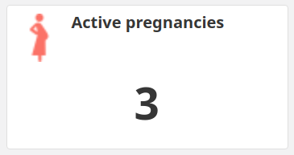
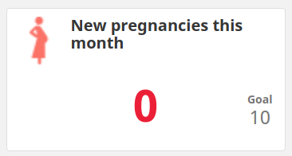
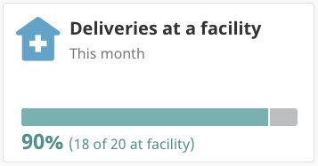
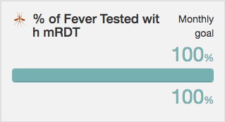

# Developing Community Health Applications

## Contents
- [Overview](#overview)
- [Prerequisites](#prerequisites)
- [Settings](#settings)
- [Forms](#forms)
- [Tasks](#tasks)
- [Targets](#targets)
- [Contacts](#contacts)
  - [Context](#context)
  - [Fields](#fields)
  - [Cards](#cards)
- [Functions](#functions)
- [Localization](#localization)
- [Graphics](#graphics)
  - [Icons](#icons)
  - [Branding](#branding)
  - [Partner Logos](#partner-logos)

## Overview
The _Community Health Application Framework_ was designed and built for a new wave of community health workers and integrated health systems. With it you can build applications for community health workers, nurses or skilled birth attendants in communities or facilities, managers on supervisory visits, and other people who deliver care and support. The framework supports any language and works with or without internet connectivity, running on basic phones, smartphones, tablets, and computers. We are committed to developing open-source software, sharing learnings, and lowering barriers to adoption, scale, and reach for these tools.

Applications built with the framework can have automated and prioritized lists of upcoming tasks, covering all of a health worker's activities in their community. Health workers are guided through tasks — such as screening for high-risk pregnancies or diagnosing and providing treatments for children — and get real-time indicators for progress towards their goals. These workflows are highly flexible and developed using a combination of JavaScript, JSON, and XForms. The JavaScript and JSON portions allow for full control of tasks, targets, and contact profiles, as well as other application settings. The XForms portion extends the ODK XForm notation, and is used to define forms. Forms allow CHWs to register new families and people. Forms also allow CHWs to complete surveys, care guides, and decision support, eg when assessing a sick child, or registering a new pregnancy for antenatal care schedule. Forms can live in many parts of the app including the Tasks, People, and Reports pages.

Having robust application code is pivotal in having a successful deployment of any software tool. Historically, Tasks, Targets, and Contact Summary were generated by JavaScript code that was difficult to write, understand, maintain, and test. As the number of workflows and elements increased, so did the complexity -- exponentially. We have gone through great effort to simplify the process, making it much easier to develop applications using the Community Health Application Framework. Robust applications can now quickly be built and maintained because tasks, targets, contact profile fields and condition cards can be defined independently with their own logic. As a result, editing existing elements requires understanding of that individual element only, and changes to one element do not impact others in the application.

This document is meant to be a introduction and reference for developing forms, tasks, targets, and contact profiles when building your own community health app.

## Prerequisites

### Test Instance
To build your own application using the framework you will need an instance set up for testing. You can set up a local instance by [following these instructions](https://github.com/medic/medic#easy-local-deployment).

### Build tool
The build tool for applications using the framework is `medic-conf`. Follow the installation instructions [here](https://github.com/medic/medic-conf/blob/master/README.md). To properly use the tool you will need your application files in set locations within a folder. Once you are set up with the basic file structure you can edit the files and rebuild the application by compiling or converting components as needed, and uploading them to your test instance.

### Background skills
To build applications with the Community Health Application Framework the follow skills are helpful, ordered by importance:

#### XLSForms and XForms
Many workflows in your application, including completing tasks and creating contacts, will be generated using [ODK XForms](https://opendatakit.github.io/xforms-spec/). Many app developers use XLSForms as an easier way to generate XForms. A strong knowledge of [XLSForm standard](http://xlsform.org/) is very useful in building your own application.

#### JSON
JSON (JavaScript Object Notation) is a format for storing structured text. Understanding JSON will help with minor modification of existing applications.

#### Javascript
Many key aspects are defined with JavaScript code and expressions. This includes managing profile pages, creating tasks and targets, and setting the condition for when to show forms. Unless you are only doing minor modification to an existing application, a good understanding of JavaScript is required.

#### CouchDB
A free and open source NoSQL database we use to store all our data, configuration, and even the application code. CouchDB is really good at replication which is the process of sending the data to another database, such as PouchDB in the client application, and back again. Although building your own app using the application framework does not require knowledge or experience with CouchDB it can be useful to be familiar with general concepts as a document store.

#### SQL
Although the application you build uses a NoSQL database, a parallel PostgreSQL database is available in the Application Framework to make querying data easier. Familiarity with SQL is needed to set up and query the database.

## Settings
The settings which control your app are defined in the `app_settings.json` file. This file can be manually edited to modify individual settings. The code for some components, like tasks and targets, gets compiled into this file with the `compile-app-settings` action in the `medic-conf` tool.

Some settings can be modified in the Admin Console of the app. Make sure to not overwrite changes done in the Admin Console by first running the `backup-app-settings` action with the `medic-conf` tool and comparing your changes. When you are ready to push your changes to the app, use the `upload-app-settings` action with `medic-conf`. 

## Forms
Whether using your application in the browser or via an Android app, all Contact creation/edit forms, care guides for decision support, and surveys are defined using [ODK XForms](https://opendatakit.github.io/xforms-spec/) -- a XML definition of the structure and format for a set of questions. Since writing raw XML can be tedious, we suggest creating the forms using the [XLSForm standard](http://xlsform.org/), and using the [medic-conf](https://github.com/medic/medic-conf) command line configurer tool to convert them to XForm format. The instructions below assume some knowledge of XLSForm, and distinguish between Contact forms (those used to create and edit contacts), other App forms (which are used for care guides and surveys). Information about Medic-specific XForm features, and form definitions for _Medic Collect_ and SMS can be found in the broader [Forms documentation](forms.md).

### Contact Forms

Contact forms are used for the creation and editing of each contact. The type associated to people is `person`, and there are three types of places corresponding to levels in the app: `district_hospital` > `health_center` > `clinic`. The display names for the place levels can be changed via [custom translations](#localization), and wherever they are defined in the contact forms. Each contact type has its own XForm where it defines the fields that it wants to store/edit for the contact:

    - /forms/contact/person-create.xml
    - /forms/contact/person-edit.xml
    - /forms/contact/clinic-create.xml
    - /forms/contact/clinic-edit.xml
    - /forms/contact/health_center-create.xml
    - /forms/contact/health_center-edit.xml
    - /forms/contact/district_hospital-create.xml
    - /forms/contact/district_hospital-edit.xml
    
To create the above XForm files it is recommended to use XLSForms. Also, if the contact forms will be similar for all places, you can use a `PLACE_TYPE-create.xlsx` file for creation, a `PLACE_TYPE-edit.xlsx` for editing, and have `medic-conf` generate the individual forms. For this you would also need `forms/contact/places.json`, where you would define the place names. From the XLSForm you can refer to the place type with `PLACE_TYPE`, and the place name with `PLACE_NAME`. You can even use the place type for conditional behaviour in the form. The base files needed would therefore be:


    - /forms/contact/person-create.xlsx
    - /forms/contact/person-edit.xlsx
    - /forms/contact/PLACE_TYPE-create.xlsx
    - /forms/contact/PLACE_TYPE-edit.xlsx
    - /forms/contact/places.json

Here is an example of a `places.json` files: 

    {
      "clinic": "Village Clinic",
      "health_center": "Health Center",
      "district_hospital": "District Hospital"
    }

#### Build

Convert and build the contact forms into your application using the `convert-contact-forms` and `upload-contact-forms` actions in `medic-conf`.

    medic-conf --local convert-contact-forms upload-contact-form


### App Forms
Workflows within your app rely heavily care guides, decision support, and surveys, which are collectively referred to as "app forms". App developers use the XForms standard to define app forms. When a user completes an app form, the contents are saved in the database with the type `data_record`. These docs are known as _Reports_. 

 Each form can have the following files:

- A XLSForm form definition, converted to the XForm (optional) 
- A XML form definition using the ODK XForm format
- Meta information in the `{form_name}.properties.json` file (optional)
- Media files in the `{form_name}-media` directory (optional)

A typical form starts with an `inputs` group which contains prepopulated fields that may be needed during the completion of the form (eg patient's name, prior information), and ends with a summary group (eg `group_summary`, or `group_review`) where important information is shown to the user before they submit the form. In between these two is the form flow, usually a collection of questions grouped into pages. All data fields submitted with a form are stored, but often important information that will need to be accessed from the form is brought to the top level. To make sure forms are properly associated to a contact, make sure at least one of `place_id`, `patient_id`, and `patient_uuid` is stored at the top level of the form.

| type | name | label | relevant | appearance | calculate | ... |
|---|---|---|---|---|---|---|
| begin group | inputs | Inputs | ./source = 'user' | field-list |
| hidden | source |
| hidden | source_id |
| begin group | contact |
| db:person | _id | Patient ID |  | db-object |
| string | patient_id | Medic ID |  | hidden |
| string | name | Patient Name |  | hidden |
| end group
| end group
| calculate | _id | | | | ../inputs/contact/_id |
| calculate | patient_id | | | | ../inputs/contact/patient_id |
| calculate | name | | | | ../inputs/contact/name |
| ...
| begin group | group_summary | Summary |  | field-list summary |
| note | r_patient_info | \*\*${patient_name}\*\* ID: ${r_patient_id} |
| note | r_followup | Follow Up \<i class="fa fa-flag"\>\</i\> |
| note | r_followup_note | ${r_followup_instructions} |
| end group |

Some custom XLSForm types and appearances were added for the Community Health Framework. You can see some examples of these in Reference Applications. There is also additional functionality possible, described with [more detail here](https://github.com/medic/medic-docs/blob/master/configuration/forms.md#forms).

#### Form properties

The meta information in the `{form_name}.properties.json` file defines the form's title and icon, as well as when and where the form should be available.

| property | description | required |
|---|---|---|
| `title`| The form's title seen in the app. Uses a localization array using the 2-letter code, not the translation keys discussed in the [Localization section](#localization). | yes |
| `icon` | Icon associated with the form. The value is the image's key in the `resources.json` file, as described in the [Icons section](#icons) | yes |
| `context` | The context defines when and where the form should be available in the app | no |
| `context.person` | Boolean determining if the form can be seen in the Action list for a person's profile. This is still subject to the `expression`. | no |
| `context.place` | Boolean determining if the form can be seen in the Action list for a person's profile. This is still subject to the `expression`. | no |
| `context.expression` | Condition needs to evaluate to true for form to show on a profile or in reports tab. By default reports are not shown on the reports tab. On the reports tab there is no `contact` object available, therefore `"expression": "!contact"` would show the form on the Reports tab. | no |


In this example properties file, the associated form would only show on a person's page, and only if their sex is unspecified or female and they are between 10 and 65 years old:

    {
      "title": [
        {
          "locale": "en",
          "content": "New Pregnancy"
        },
        {
          "locale": "hi",
          "content": "नई गर्भावस्था"
        }
      ],
      "icon": "pregnancy-1",
      "context": {
        "person": true,
        "place": false,
        "expression": "contact.type === 'person' && (!contact.sex || contact.sex === 'female') && (!contact.date_of_birth || (ageInYears(contact) >= 10 && ageInYears(contact) < 65))"
      }
    }

#### Build
    
Forms are converted with the `convert-app-forms` or `convert-contact-forms` actions in `medic-conf`, and added to your application with the corresponding upload actions.

## Tasks
Tasks guide health workers through their days and weeks. Each task drives a workflow, ensuring that the right actions are taken for people at the right time. Tasks indicate a recommended action to the user. They indicate who the user should perform the action with and the recommended timeframe of that action. When the user taps the task, they are directed to a form where the details of the action are captured. 

Tasks are configured in the `tasks.js` file. This file is a JavaScript module which defines an array of objects conforming to the Task schema detailed below. Although the file contains JavaScript, its modular and declarative nature makes it easy to manage. Each object corresponds to a task that the app shows in the Tasks tab and on contact profiles. The properties for the object define when the task appears, how it behaves, and what it looks like. When defining tasks, you have access to all the contacts on the device (both people and places) along with all the reports about them. Tasks are available only for users of type "restricted to their place". Tasks can pull in fields from reports and pass data as inputs to the form that opens when you select the task, enabling richer user experiences.

For example, if you register a pregnancy and include the last menstrual period (LMP), you may want to generate follow-up tasks for antenatal care (ANC) visits. When you click on an ANC visit task, it will open the ANC visit form and this form could "know" the LMP of the woman. In this section we will discuss how to configure such tasks. This is what that task might look like in the Medic Webapp:

<!-- TODO: Update annotated screenshots -->


Previously, the code to generate tasks would iterate through an object with all contacts accompanied by their reports. When the code identified a condition that needs tasks, it generated a series of tasks based on templates in `tasks.json`. The tasks emitted by the rules engine code were then handled by the app. With the new declarative style all tasks are now defined in the `tasks.js` file, which contains a JavaScript array of objects. Each object corresponds to a set of task events that the app automatically shows in the Tasks tab and on contact profiles. These are automatically removed from the app when they are completed. The properties for the object are used to define when the task's events can show, and what they should look like.

Although the file contains JavaScript, its modular and declarative nature makes it much easier to manage. For instance, here is a simple example that generates two `postnatal-visit` tasks for each `delivery` form:

```js
[
  {
    icon: 'mother-child',
    title: [ { locale:'en', content:'Postnatal visit needed' } ],
    appliesTo: 'reports',
    appliesToType: [ 'delivery' ],
    actions: [ { form:'postnatal_visit' } ],
    events: [
      {
        id: 'postnatal-visit-1',
        days:7, start:2, end:2,
      },
      {
        id: 'postnatal-visit-2',
        days:14, start:2, end:2,
      }
    ]
  }
]
```

### Task properties

More complex tasks can be written using the full set of properties for tasks, as detailed in the following table.

| property | description | required |
|---|---|---|
| `name`| Unique identifier for the task. | no |
| `icon` | The icon to show alongside the task. | no |
| `title` | The title of the task when shown in the app. Structured as a localization label array or a translation. | yes |
| `appliesTo` | `'contacts'`, `'reports'`, or `'scheduled_tasks'`. The items on which the task is applied. | yes |
| `appliesToType` | Array of report or contact types. The types of contacts (eg `['person']`, `['clinic', 'health_center']`) or form codes (eg `['pregnancy']`, `['P', 'pregnancy']`) for which this task should be associated. | yes |
| `appliesIf` | function(contact, report, scheduledTaskIndex). The task can only be created for items where this function returns true. `scheduledTaskIndex` will be null for contacts and reports. | no |
| `resolvedIf` | function(contact, report, event, dueDate, index). Resolve the task only if this function returns true. | yes |
| `events` | An array of task events. The event's properties are used to specify the timeline of when a task will appear and disappear from the user interface. | yes |
| `events[n].id` | Unique ID for this task event. Helps when this is a descriptive id, eg `pregnancy-high-risk` | yes |
| `events[n].days` | Number of days after the doc's `reported_date` that the event is due | yes, if `dueDate` is not set |
| `events[n].start` | Number of days to show the task before it is due | yes |
| `events[n].end` | Number of days to show the task after it is due | yes |
| `events[n].dueDate` | function(report, event, scheduledTaskIdx). A date object of the day when the task event is due. If set this will override the `days` value. | yes, if `days` is not set |
| `actions` | This is an array of the actions (forms) that a user can access after clicking on a task. If you put multiple forms here, then the user will see a task summary screen where they can select which action they would like to complete. Within your array of `actions` there are some additional properties that you can define. | yes |
| `actions[n].type` | Type of action, usually `'report'`. | yes |
| `actions[n].form` | The form that should open when you click on the action. | yes |
| `actions[n].label`|  The label that should appear on the button to start this action on the task summary page ('Click here to begin the follow up' in our example summary screen above). | no |
| `actions[n].content`|  Contains fields that you want to pass into the form that will open when you click on the task or action. | no |
| `priority` | Object with the priority `level` and `label`. Can alternatively be a function that, given the contact and report an object with the priority `level` and `label`. | no |
| `priority.level` | Can be `high`, `medium` (default). Tasks that are high risk will display a high risk icon with the task. | no |
| `priority.label` | Text shown with the task associated to the risk level. | no |

### Additional code
Helper variables and functions can be defined in `nools-extras.js` to keep the task definitions easy to read and manage. To enable reuse of common code, `nools-extras.js` file is shared by both the Tasks and Targets.

### Examples

#### tasks.js
```js
[
  // PNC TASK 1: If a home delivery, needs clinic tasks
  {
    icon: 'mother-child',
    title: [ { locale:'en', content:'Postnatal visit needed' } ],
    appliesTo: 'reports',
    appliesToType: [ 'D', 'delivery' ],
    appliesIf: function(c, r) {
      return isCoveredByUseCase(c.contact, 'pnc') &&
          r.fields &&
             r.fields.delivery_code &&
             r.fields.delivery_code.toUpperCase() !== 'F';
    },
    actions: [{ 
      form:'postnatal_visit',
      // Pass content that will be used within the task form
      modifyContent: function(r, content) {
        content.delivery_place = 'home';
      }
    }],
    events: [ {
      id: 'postnatal-home-birth',
      days:0, start:0, end:4,
    } ],
    priority: {
      level: 'high',
      label: [ { locale:'en', content:'Home Birth' } ],
    },
    resolvedIf: function(c, r, event, dueDate) {
      // Resolved if there a visit report received in time window or a newer pregnancy
      return r.reported_date < getNewestDeliveryTimestamp(c) ||
             r.reported_date < getNewestPregnancyTimestamp(c) ||
             isFormFromArraySubmittedInWindow(c.reports, postnatalForms,
                 Utils.addDate(dueDate, -event.start).getTime(),
                 Utils.addDate(dueDate,  event.end+1).getTime());
    },
  },

  // Option 1a: Place-based task: Family survey when place is created, then every 6 months
  {
    icon: 'family',
    title: 'task.family_survey.title',
    appliesTo: 'contacts',
    appliesToType: [ 'clinic' ],
    actions: [ { form:'family_survey' } ],
    events: [ {
      id: 'family-survey',
      days:0, start:0, end:14,
    } ],
    resolvedIf: function(c, r, event, dueDate) {
      // Resolved if there a family survey received in time window
      return isFormFromArraySubmittedInWindow(c.reports, 'family_survey',
                 Utils.addDate(dueDate, -event.start).getTime(),
                 Utils.addDate(dueDate,  event.end+1).getTime());
    },
  },
  // Regular check for infants
  {
    icon: 'infant',
    title: 'task.infant.title',
    appliesTo: 'contacts',
    appliesToType: [ 'person' ],
    actions: [ { form:'infant_assessment' } ],
    events: [ 
      {
        id: 'infant_asssessment-q1',
        days:91, start:7, end:14,
      },
      {
        id: 'infant_asssessment-q2',
        days:182, start:7, end:14,
      },
      {
        id: 'infant_asssessment-q3',
        days:273, start:7, end:14,
      },
      {
        id: 'infant_asssessment-q4',
        days:365, start:7, end:14,
      }
    ]
  },

  // Option 2: Place-based task: Family survey every 6 months
  {
    icon: 'family',
    title: 'task.family_survey.title',
    appliesTo: 'contacts',
    appliesToType: [ 'clinic' ],
    appliesIf: needsFamilySurvey, // function returns true if family doesn't have survey in previous 6 months
    actions: [ { form:'family_survey' } ],
    events: [ {
      id: 'family-survey',
      start:0, end:14,
      dueDate: getNextFamilySurveyDate  // function gets expected date of next family survey 
    } ],
    resolvedIf: function(c, r, event, dueDate) {
      // Resolved if there a family survey received in time window
      return isFormFromArraySubmittedInWindow(c.reports, 'family_survey',
                 Utils.addDate(dueDate, -event.start).getTime(),
                 Utils.addDate(dueDate,  event.end+1).getTime());
    },
  },

]
```

#### nools-extras.js
```js
function isCoveredByUseCase(contact, usecase) {
    // ...
}
function getNewestDeliveryTimestamp(c) {
    // ...
}
function getNewestPregnancyTimestamp(c) {
    // ...
}
function isFormFromArraySubmittedInWindow(reports, formsArray, startTime, endTime) {
    // ...
}
```

#### What to put in appliesIf vs resolvedIf
Both functions `appliesIf` and `resolvedIf` capture logic for when your task should appear to the user. So why are there two functions which seemingly result in the same behaviour? The answer is that once a task appears (`appliesIf: true`, `resolvedIf: false`), that task will not disappear until it is explicitly told to resolve (`appliesIf: true`, `resolvedIf: true`). If you're seeing your task linger when you expect it to disappear, but it does disappear when you reload the page (refresh the browser) - you probably need to move logic from `appliesIf` into `resolvedIf`.

Generally:

* `appliesIf` should contain your immutable expectations for the task - conditions that are needed for the task to appear, but that you don't expect to change once they are met. If this function returns `true` today and then returns `false` tomorrow for the same input, it will block you from correctly resolving the emitted tasks.
* `resolvedIf` should capture the change in state which (in addition to the logic in appliesIf being true) causes the task to resolve.

So why not put everything in `resolvedIf` and this will always work without thinking? You can. But there are negative performance implications of doing this, and you should endeavour to capture all that you can in `appliesIf` without breaking things. This performance concern is particularly important for tasks with `appliesTo: 'reports'`.

Logic to test if a contact has a form x existing before any form y, or testing if the task's action form is present within the event window - these are examples of bad things to put in `appliesIf` functions.

#### Tips & Tricks
1. There are some use cases where information collected during an action within a task schedule may mean that the task schedule must change. For example, if you register a child for malnutrition follow-ups, you collect the height and weight during registration and tasks for follow-ups are created based on the registration. At the next visit (first follow-up), you collect the height and weight again and you want to update these so that future tasks reference this new height and weight. You can either clear and regenerate the schedule after each follow-up visit is done, or you can create only one follow-up at a time so that height and weight are always referencing the most recent visit.

1. If you have a single action for a task, clicking the task will bring you straight to the specified form.


1. If you have more than one action, clicking a prompted task will show a summary screen with fields you have passed along with a button for each possible action.


#### Troubleshooting
1. Cannot see tasks: Makes sure in the Admin Console that the user is an offline user that is "restricted to their place".

#### Build

To build your tasks into your app, you must compile them into app-settings, then upload them to your instance.

    medic-conf --local compile-app-settings backup-app-settings upload-app-settings 

## Targets
Health workers can easily view their goals and progress for the month, even while offline. Targets refer to in-app analytics widgets displayed on the Analytics Tab. Targets can only be seen by users that have offline access (user type is "restricted to their place"). When defining targets, you have access to all the contacts (people and places) that the logged in user has on their device, along with all the reports about them.

Targets can be set to track metrics for an individual CHW or for an entire health facility, depending on what data the logged in user has access to. Here are some example targets:

<!-- TODO: Update annotated screenshots -->

##### Plain count with no goal



##### Count with a goal



##### Percentage with no goal



##### Percentage with a goal



The app takes care of showing the targets in the Targets tab, and updating counts and percentages automatically. All targets are defined in the `targets.js` file. In this file we define an array of objects which match the Target schema defined below. Each object corresponds to a target widget that shows in the app. The properties of the object are used to define when the target should appear, what it should look like, and the values it will display. 

Like `tasks.js`, the Targets file contains JavaScript but its modular and declarative nature makes it easy to manage. Here is a simple example that tracks the number of healthy births per month:

```js
var targets = [
  // BIRTHS THIS MONTH
  {
    id: 'births-this-month',
    type: 'count',
    icon: 'infant',
    goal: -1,
    translation_key: 'targets.births.title',
    appliesTo: 'reports',
    appliesIf: isHealthyDelivery,
  },
```

### Target properties

More complex targets can be written using the full set of properties for targets, as detailed in the following table: 

| property | description | required |
|---|---|---|
| `id` |Unique identifier for the target | yes |
| `type` |The type of widget to show, either `count` or `percent`. | yes |
| `icon` |Icon to show with the target, matching the name in the resources file. | no, but recommended |
| `goal` |For percentage targets, you must put a positive number. For `count` targets, put a positive number if there is a goal. If there is no goal, put -1. | yes |
| `context` |The context in which this widget is relevant to the `user`. This widget will only be shown if the expression evaluates to true. | no |
| `translation_key` |Translation key for the title of this target. | no, but recommended |
| `subtitle_translation_key` |Translation key for the subtitle of this target. If none supplied the subtitle will be blank. | no |
| `percentage_count_translation_key` |Translation key for the percentage value detail shown at the bottom of the target, eg |"(5 of 6 deliveries)". The translation context has `pass` and `total` variables available. If none supplied this defaults to `targets.count.default`. | no |
| `appliesTo` | `'contacts'` or `'reports'`. The items which apply for this target widget. | yes |
| `appliesToType` | Array of report or contact types. The types of contacts (eg `['person']`, `['clinic', 'health_center']`) or form codes (eg `['pregnancy']`, `['P', 'pregnancy']`) for which this target is relevant. | yes |
| `appliesIf` | function(contact, report, scheduledTaskIndex). The target is relevant only for items where this function returns true. `scheduledTaskIndex` will be null for contacts and reports. | no |
| `date` | By default only values for this month are shown in targets. Set to `'now'` if doing an all time count. Set to `'reported'` for time relevant counts, which relies on the doc's `reported_date`. | no |
| `emitCustom` | function(contact, report). Each defined target emits one target instance per doc. A function can be defined here to emit a custom target instance, or multiple instances. | no |
| `idType` | By default only one target instance is counted per contact. When multiple reports should be counted, eg counting multiple visits for a person, this property must be set to `'report'`. | no |
| `passesIf` | function(contact, report). Evaluated to determine if instance counts towards the value. For percent widgets this affects whether the instance is included in the numerator. | yes, if `type` is `'percent'` |

### Additional code
Helper variables and functions can be defined in `nools-extras.js` to keep the target definitions easy to read and manage. To enable reuse of common code, `nools-extras.js` file is shared by both the Tasks and Targets.

### Examples

#### targets.js
```js
var targets = [
  // BIRTHS THIS MONTH
  {
    id: 'births-this-month',
    type: 'count',
    icon: 'infant',
    goal: -1,
    translation_key: 'targets.births.title',
    subtitle_translation_key: 'targets.this_month.subtitle',

    appliesTo: 'reports',
    appliesIf: isHealthyDelivery,
    date: 'reported',
  },

  // % DELIVERIES ALL TIME WITH 1+ VISITS
  {
    id: 'delivery-with-min-1-visit',
    type: 'percent',
    icon: 'nurse',
    goal: 100,
    translation_key: 'targets.delivery_1_visit.title',
    subtitle_translation_key: 'targets.all_time.subtitle',

    appliesTo: 'reports',
    idType: 'report',
    appliesIf: isHealthyDelivery,
    passesIf: function(c, r) {
      var visits = countReportsSubmittedInWindow(c.reports, antenatalForms, r.reported_date - MAX_DAYS_IN_PREGNANCY*MS_IN_DAY, r.reported_date);
      return visits > 0;
    },
    date: 'now',
  },
]
```

#### nools-extras.js
```js
function isHealthyDelivery(c, r) {
  return r.form === 'D' ||
      (r.form === 'delivery' && r.fields.pregnancy_outcome === 'healthy');
}

function countReportsSubmittedInWindow(reports, form, start, end) {
  var reportsFound = 0;
  reports.forEach(function(r) {
    if (form.indexOf(r.form) >= 0) {
      if (r.reported_date >= start && r.reported_date <= end) {
        reportsFound++;
      }
    }
  });
  return reportsFound;
}

```

#### Build

To build your targets into your app, you must compile them into app-settings, then upload them to your instance.

    medic-conf --local compile-app-settings backup-app-settings upload-app-settings 


## Contacts
In the `app_settings.contact_summary` you can write a script to output fields for the contact info pane and help decide which reports should be able to be filed against a contact. The script is evaluated as JavaScript so all the standard language features are available. To make this easier to write and maintain, a declarative format is also available. In the `contact_summary.templated.js` file you specify three variables: `context`, `fields`, and `cards`.

<!-- TODO: Add annotated screenshot of a contact page showing structure -->

### Context
This object provides context information to Actions (aka "app forms") on the contact's profile page. The app form's `expression` can use the context to determine whether or not to show the form in the "New action" menu. When opening the action from the contact profile the context data is also available within the XForm.

### Fields
An array of fields are defined to show a summary of the contact at the top of their profile page.


<!-- TODO: Add updated annotated screenshot of summary card -->

Each field that can be shown on a contact's profile is defined as an objects in the `fields` array. The properties for each object determine how and when the field is shown.

| property | description | required |
|---|---|---|
| `appliesToType` | The type of contact with which this field should show. Set to `'person'` for person profile, or `'!person'` a place. | no | 
| `label` | Label shown with the field. Can be a translation key.  | yes |
| `value` | `function(r)`. The value shown for the field. Can be a property of the contact, eg `contact.date_of_birth`. | yes |
| `width` | The horizontal space for the field. Common values are 12 for full width, 6 for half width, or 3 for quarter width.| |
| `appliesIf` | A function that determines when the field should be shown. | no |
| `translate` | Whether or not to translate the value. Defaults to false. <!-- TODO: VERIFY IMPLEMENTED --> | no |
| `context` |  The fields available in the value's translation. eg {} | no | 
| `icon` | The name of the icon to display beside this field, as defined through the Configuration > Icons page. | no |
| `filter` | The display filter to apply to the value, eg: `{ value: '2005-10-09', filter: 'age' }` will render as "11 years". Common filters are: `age`, `phone`, `weeksPregnant`, `relativeDate`, `relativeDay`, `fullDate`, `simpleDate`, `simpleDateTime`, `lineage`, `resourceIcon`. For the complete list of filters, and more details on what each does, check out the code in [`medic/webapp/src/js/filters` dir](https://github.com/medic/medic/tree/master/webapp/src/js/filters). | no |

### Cards
An array of cards to show below the summary on the profile page. Each card has its own header and arrays of fields.


<!-- TODO: Add updated annotated screenshot of a profile card -->

| property | description | required |
|---|---|---|
| `label` | Label on top of card | yes |
| `appliesToType` | Type of contact where the card could show | no |
| `appliesIf` | Function that determines if the card should show | no |
| `fields` | Object for each field to show in the card | yes |
| `fields.label` | Label shown with the field. Can be a translation key.  | yes |
| `fields.value` | `function(r)`. The value shown for the field. Can be a property of the contact, eg `contact.date_of_birth`. | yes |
| `fields.width` | The horizontal space for the field. Common values are 12 for full width, 6 for half width, or 3 for quarter width.| |
| `fields.appliesIf` | A function that determines when the field should be shown. | no |
| `fields.translate` | Whether or not to translate the value. Defaults to false. <!--TODO: VERIFY IMPLEMENTED--> | no |
| `fields.context` |  The fields available in the value's translation. eg {} | no | 
| `fields.icon` | The name of the icon to display beside this field, as defined through the Configuration > Icons page. | no |
| `modifyContext` | function(ctx) | Used to modify or add values of the `context` | no |

### Examples

#### contact-summary.templated.js
```js
context = {
  use_cases: {
    anc: isCoveredByUseCaseInLineage(lineage, 'anc'),
    pnc: isCoveredByUseCaseInLineage(lineage, 'pnc'),
  },
};

fields = [
  { appliesToType:'person',  label:'patient_id', value:contact.patient_id, width: 4 },
  { appliesToType:'person',  label:'contact.age', value:contact.date_of_birth, width: 4, filter: 'age' },
  { appliesToType:'person',  label:'contact.parent', value:lineage, filter: 'lineage' },
  { appliesToType:'!person', appliesIf:function() { return contact.parent && lineage[0]; }, label:'contact.parent', value:lineage, filter:'lineage' },
];

cards = [
  {
    label: 'contact.profile.pregnancy',
    appliesToType: 'report',
    appliesIf: isActivePregnancy,
    fields: [
      {
        label: 'contact.profile.edd',
        value: function(r) { return r.fields.edd_8601; },
        filter: 'relativeDay',
        width: 12
      },
      {
        label: 'contact.profile.visit',
        value: 'contact.profile.visits.of',
        translate: true,
        context: {
          count: function(r) { return getSubsequentVisits(r).length; },
          total: 4,
        },
        width: 6,
      },
      {
        label: 'contact.profile.risk.title',
        value: function(r) { return isHighRiskPregnancy(r) ? 'high':'normal';
        },
        translate: true,
        width: 5,
        icon: function(r) { return isHighRiskPregnancy(r) ? 'risk' : ''; },
      },
    ],
    modifyContext: function(ctx) {
      ctx.pregnant = true; // don't show Create Pregnancy Report button
    },
  },

```

#### contact-summary-extras.js
```js
function isActivePregnancy(r) {
  // ...
}
var isCoveredByUseCaseInLineage = function(lineage, usecase) {
  // ...
};
var isHighRiskPregnancy = function(pregnancy) {
  // ...
}
function getSubsequentVisits(r) {
  // ...
}
```

#### Build

To build your profile summary, cards, or context into your app, you must compile them into app-settings, then upload them to your instance.

    medic-conf --local compile-app-settings backup-app-settings upload-app-settings 


## Functions

### Nools Extras
Helper variables and functions can be defined in `nools-extras.js`, which is shared by both `tasks.js` and `targets.js`. The following are global variables that can be used:

| Variable | Description |
|---|---|
| `c.contact` | The contact's doc. All contacts have `type` of either `person` or `place`.
| `c.reports` | An array of all the reports submitted about the contact.
| `console` | Useful for outputting _debugging_ statements. Should not be used in production code. |
| `Utils` | Useful functions across projects are available, and describe in the Utils section. |

### Contact Summary Extras
Helper variables and functions for the contact summary can be defined in `contact-summary-extras.js`. There are several variables available to inspect to generate the summary information:

| Variable | Description |
|---|---|
| `contact` | The currently selected contact. This has minimal stubs for the `contact.parent`, so if you want to refer to a property on the parent use `lineage` below.| 
| `reports` | An array of reports for the contact. | 
| `lineage` | An array of the contact's parents (2.13+), eg `lineage[0]` is the parent, `lineage[1]` is the grandparent, etc. Each lineage entry has full information for the contact, so you can use `lineage[1].contact.phone`. | 

### Utils
Utility functions in the application framework can make common tasks much easier. These are available only for Tasks and Targets. To use the function call `Utils.<function-name>(<params>)`, for example `Utils.addDate(report.reported_date, 10)`.

| Name | Description |
|---|---|
| isTimely(date, event) | Returns true if the given date is after the start date and before the end date of the event. |
| addDate(date, days) | Returns a new Date set to midnight the given number of days after the given date. If no date is given the date defaults to today. |
| getLmpDate(doc) | Attempts to work out the LMP from the given doc. If no LMP is given it defaults to four weeks before the reported_date. |
| getSchedule(name) | Returns the task schedule with the given name from the configuration. |
| getMostRecentTimestamp(reports, form) | Returns the reported_date of the most recent of the reports with form ID matching the given form. |
| getMostRecentReport(reports, form) | Like `getMostRecentTimestamp` but returns the report, not just the reported_date. |
| isFormSubmittedInWindow(reports, form, start, end) | Returns true if any of the given reports are for the given form and were reported after start and before end. |
| isFirstReportNewer(firstReport, secondReport) | Returns true if the firstReport was reported before the secondReport. |
| isDateValid(date) | Returns true if the given date is a validate JavaScript Date. |
| now() | Returns the current Date. |
| MS_IN_DAY | A constant for the number of milliseconds in a day. |

If you can think of any others you'd like to be included raise an issue in [medic/medic](https://github.com/medic/medic/issues).

## Localization
Given that apps built using the Community Health Application Framework are used around the world, the framework was designed with localization in mind. The framework itself is available in English, French, Hindi, Nepali, Spanish, Swahili, and Indonesian. In the `app_settings.json` file you'll see the default language for the application, and a separate default language for outgoing messages that are sent via SMS. Please contact the Medic Mobile team (hello@medicmobile.org) if you are interested in translating the app into a different language, as we can work together to make that language available to the community.

If you are looking to modify some labels in the app you can do so by adding the key and modified label in a custom translations file in your `translations` folder. All the properties files use the format `messages-{language-code}.properties`, where the language code is the same 2-letter code used to identify the language in the application. For instance, for English, we would have a `translations/messages-en.properties` file. 

New elements in your app, such as tasks, targets, profiles, and forms should be localized as well. These labels should be included in the same custom translations properties file. Here is an example, including both a modified label, and a new one:

    [Application Text]
    contact.type.district_hospital = Community
    targets.assessments.title = Assessments Completed

If a translation is missing for the user's language it will use that of the default language. 

### Forms

Translations for XForms are defined within the forms themselves. The XLSForm notation is [documented here](http://xlsform.org/en/#multiple-language-support), and would use the corresponding 2-character language codes.

### Build

Custom translations from the properties files are added to your app with the `upload-custom-translations` action.

    medic-conf --local upload-custom-translations
    
Updated translations from forms need to be added with the actions to upload forms.

    medic-conf --local upload-contact-forms upload-app-forms


# Graphics

## Icons
You can customize your app with your own icons, or reuse some from Medic Mobile's [Icon Library](https://github.com/medic/icon-library). To do so, add icons to the `resources` folder, and include them by name in the resources.json file. 

    {
        "icon-risk": "icon-healthcare-warning@2x.png",
        "icon-treatment": "icon-healthcare-medicine@2x.png",
        "medic-clinic": "medic-family.svg",
        "medic-district-hospital": "medic-health-center.svg",
        "medic-health-center": "medic-chw-area.svg",
        "medic-person": "medic-person.svg"
    }
  
You can then add them to your application with the `upload-resources` action in `medic-conf`.

    medic-conf --local upload-resources 

## Branding

The site title, favicon, and header logo are configurable. The location to change these are in the Admin console on the images page under the branding tab. 


## Partner logos

Adding your partner logos can be done in the Admin console on the images page under the Partners tab. This will add partner logos on the about page. 

