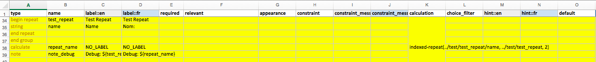
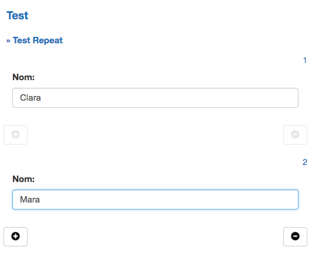

# XForms HowTo

* [Show a value from within a repeat group](#get-value-from-repeat-group)

_Add some more examples here..._

## Get value from repeat group

#### Scenario

There exists a repeat group within the form that captures data for a group of entities. One is interested in getting values
from the set for a specific entity and using the value(s).

#### Use Case

*Project*: [Muso IN](https://github.com/medic/medic-projects/tree/master/muso_in)
*Description*: For the Supervisor App, when a supervisor is conducting a visit and they need to evaluate a number of patients yet only show
details for the first evaluated patient in the summary section of the form.

#### Show me

- Building the section in the xform. 
- Enter data in the app. 
- Show value you are interested in. 

#### Gotchas

- The `indexed-repeat()` function is not zero based index.

#### References

- https://opendatakit.org/help/form-design/#xpath_expressions
- https://opendatakit.org/help/form-design/binding/
