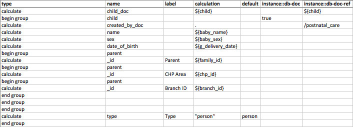
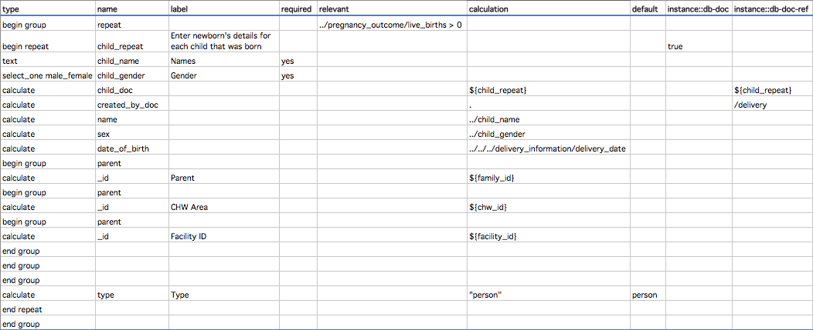

# Forms

Forms define information flows. Users can fill in forms by SMS, SIM applications, Medic Collect, or via the webapp in a browser or the Android app. Forms can be used for a vairety of purposes, including creating new patients, registering them for SMS reminders, reporting a patient visit or status. 

There are two types of forms: 
- **JSON forms**: used for SMS interfaces such as formatted SMS, SIM applications, and Medic Collect. Forms for Medic Collect must also have a corresponding XForm definition to be rendered on Android devices.
- **XForms**: used for forms used within the web app, whether it is accessed in browser or via the Android app.

## JSON forms
Used for SMS interfaces such as formatted SMS, SIM applications, and Medic Collect. You can view the list of JSON forms and load new ones through the webapp's Configuration pages, or via the `forms` field of `app_settings.json`. Each form has fields defined in our specific JSON format, eg:

```js
{
  "F": {
    "meta": {
      "code": "F",
      "icon": "risk",
      "translation_key": "form.flag.title" // displayed in the webapp
    },
    "fields": {
      "patient_id": { // this is used for the property name when the report doc is created
        "labels": {
          "short": { "translation_key": "form.flag.patient_id.short" }, // displayed in the webapp
          "tiny": "pid" // used in form submission to bind values to fields - not required for all submission formats
        },
        "position": 0, // specifies where in the SMS this value should be
        "type": "string",
        "flags": {
          "input_digits_only": true
        },
        "length": [ 5, 13 ],
        "required": true
      },
      "notes": {
        "labels": {
          "short": { "translation_key": "form.flag.notes.short" },
          "tiny": "form.flag.notes.tiny"
        },
        "position": 1,
        "type": "string",
        "length": [ 1, 100 ],
        "required": false
      }
    },
    "public_form": true
  }
}
```

## Supported data types

We currently support the following data types:
 - `"integer"`: a whole number
 - `"string"`: any collection of characters
 - `"date"`: a date in the format `YYYY-mm-dd`, for example "2019-01-28"
 - `"boolean"`: true or false, represented by the digit `1` and `0` respectively.

# XForms
The XForms are used for all Actions, Tasks, and Contact Creation/Edit forms within the web app, whether it is accessed in browser or via the Android app. We generally create these in Excel using the [XLSForm standard](http://xlsform.org/), and then convert them using the configurer tool ([medic-conf](https://github.com/medic/medic-conf)). You can view the list of XForms and upload new ones through the webapp's Configuration pages as well. Each form has meta information which defines in which context the form is accessible. Using `medic-config` this info is in a `{name}.properties.json` file. XML forms with IDs starting with `forms:contact:` will customize the edit/create page for the given contact (person or place) type.


_*Note that although Medic Collect uses XForms in the Android app, for now it still needs a corresponding JSON form in the webapp to interpret the incoming report._

## General Structure
A typical Action or Task form starts with an `inputs` group which contains prepopulated fields that may be needed during the completion of the form (eg patient's name, prior information), and ends with a summary group (eg `group_summary`, or `group_review`) where important information is shown to the user before they submit the form. In between these two is the form flow, usually a collection of questions grouped into pages. All data fields submitted with a form are stored, but often important information that will need to be accessed from the form is brought to the top level.

| **type** | **name** | **label** | ... |
|---|---|---|---|
| begin group | inputs | Inputs |
| string | source | Source |
| string | source_id | Source ID |
| end group| | |
| calculate | patient_id | Patient ID |
| calculate | patient_name | Patient Name |
| calculate | edd | EDD |
...
| begin group | group_review | Review |
| note | r_patient_info | \*\*${patient_name}\*\* ID: ${r_patient_id} |
| note | r_followup | Follow Up <i class="fa fa-flag"></i> |
| note | r_followup_note | ${r_followup_instructions} |
| end group| | |

## Accessing Data From Contact

XForms have the ability to access the output of the [configured contact-summary script](https://github.com/medic/medic-docs/blob/master/configuration/contact-summary.md). This means you can have different fields, state, or information based on any known information about the contact.

To configure this, add a new instance with the id "contact-summary" to your xform somewhere below your primary instance, then bind values where you need them. Note that medic-configurer automatically adds this instance to every form so you shouldn't need to do this manually. Example:

```xml
<h:html>
  <h:head>
    <model>
      <instance>
        <visit>
          <age/>
        </visit>
      </instance>
      <instance id="contact-summary"/>
      <bind calculate="instance('contact-summary')/context/age" nodeset="/visit/age" type="string"/>
    </model>
  </h:head>
  <h:body>
    <input ref="/visit/age" />
  </h:body>
</h:html>
```

As long as you have this new instance, you can then use XPath to access all values returned in `result.context`. This works without declaring in the instance which fields are needed, so it is a very flexible solution and easier to manage when building forms.

For example, a form field with `instance('contact-summary')/context/lineage[2]/name` as a calculation will get `lineage[2].name` from a contact-summary with the following code included in `contact-summary.js`:

```
...
context.lineage = lineage;
var result = {
  fields: fields,
  cards: cards,
  context: context
};
return result;
```

Note that you can pass a large object to the form, which can then read any value, but doing so does noticeably slow the loading of the form. Because of this it is preferable to remove from the context any fields that are not being used. It is a good idea to future proof by maintaining the same structure so that fields can be added without needing to modify existing form calculations.

## Creating Additional Docs

In version 2.13.0 and higher, you can configure your app forms to generate additional docs upon submission. You can create one or more docs using variations on the configuration described below. One case where this can be used is to register a newborn from a delivery report, as shown below. First, here is an overview of what you can do and how the configuration should look in XML:

### Extra Docs

- Extra docs can be added by defining structures in the model with the attribute db-doc="true". **Note that you must have lower-case `true` in your XLSform, even though Excel will default to `TRUE`.**

#### Example Form Model

```xml
<data>
  <root_prop_1>val A</root_prop_1>
  <other_doc db-doc="true">
    <type>whatever</type>
    <other_prop>val B</other_prop>
  </other_doc>
</data>
```

#### Resulting Docs

Report (as before):

```
{
  _id: '...',
  _rev: '...',
  type: 'report',
  _attachments: { xml: ... ],
  fields: {
    root_prop_1: 'val A',
  }
}
```

Other doc:

```json
{
  "_id": "...",
  "_rev": "...",
  "type": "whatever",
  "other_prop": "val B"
}
```

### Linked Docs

- Linked docs can be referred to using the doc-ref attribute, with an xpath. This can be done at any point in the model, e.g.:

#### Example Form Model

```xml
<sickness>
  <sufferer db-doc-ref="/sickness/new">
  <new db-doc="true">
    <type>person</type>
    <name>Gómez</name>
    <original_report db-doc-ref="/sickness"/>
  </new>
</sickness>
```

#### Resulting Docs

Report:

```json
{
  "_id": "abc-123",
  "_rev": "...",
  "type": "report",
  "fields": {
    "sufferer": "def-456"
  }
}
```

Other doc:

```
{
  "_id": "def-456",
  "_rev": "...",
  "type": "person",
  "name": "Gómez",
  "original_report": "abc-123"
}
```

### Repeated Docs

- Can have references to other docs, including the parent
- These currently cannot be linked from other docs, as no provision is made for indexing these docs

#### Example Form

```xml
<thing>
  <name>Ab</name>
  <related db-doc="true">
    <type>relative</type>
    <name>Bo</name>
    <parent db-doc-ref="/thing"/>
  </related>
  <related db-doc="true">
    <type>relative</type>
    <name>Ca</name>
    <parent db-doc-ref="/thing"/>
  </related>
</artist>
```

#### Resulting Docs

Report:

```json
{
  "_id": "abc-123",
  "_rev": "...",
  "type": "report",
  "fields": {
    "name": "Ab"
  }
}
```

Other docs:

```json
{
  "_id": "...",
  "_rev": "...",
  "type": "relative",
  "name": "Bo",
  "parent": "abc-123",
}
```

```json
{
  "_id": "...",
  "_rev": "...",
  "type": "relative",
  "name": "Ch",
  "parent": "abc-123",
}
```

### Linked Docs Example
This example shows how you would register a single newborn from a delivery report.

First, the relevant section of the delivery report XLSForm file:


Here is the corresponding portion of XML generated after converting the form:

```xml
<repeat>
  <child_repeat db-doc="true" jr:template="">
    <child_name/>
    <child_gender/>
    <child_doc db-doc-ref=" /delivery/repeat/child_repeat "/>
    <created_by_doc db-doc-ref="/delivery"/>
    <name/>
    <sex/>
    <date_of_birth/>
    <parent>
      <_id/>
      <parent>
        <_id/>
        <parent>
          <_id/>
        </parent>
      </parent>
    </parent>
    <type>person</type>
  </child_repeat>
</repeat>
```

If you've done your configuration correctly, all you should see when you click on the submitted report from the Reports tab is the `child_doc` field with an `_id` that corresponds to the linked doc. In this case, you could look for that `_id` on the People tab or in the DB itself to confirm that the resulting doc looks correct.

### Repeated Docs Example
This example extends the above example to show how you would register one or multiple newborns from a delivery report. This allows you to handle multiple births.

First, the relevant section of the delivery report XLSForm file:


Here is the corresponding portion of XML generated after converting the form:

```xml
<child_doc db-doc-ref=" /postnatal_care/child "/>
<child db-doc="true">
  <created_by_doc db-doc-ref="/postnatal_care"/>
  <name/>
  <sex/>
  <date_of_birth/>
  <parent>
    <_id/>
    <parent>
      <_id/>
      <parent>
        <_id/>
      </parent>
    </parent>
  </parent>
  <type>person</type>
</child>
```

If you've done your configuration correctly, all you should see when you click on the submitted report from the Reports tab is the `child_doc` field with an `_id` that corresponds to the first doc that was created. The other docs will have a link to the report that created them but the report will not link directly to them. Again, you could look for that `_id` on the People tab or in the DB itself to confirm that the resulting docs look correct.

## Uploading Binary Attachments

Forms can include arbitrary binary data which is submitted and included in the doc as an attachment. If this is an image type it'll then be displayed inline in the report UI.

To mark an element as having binary data add an extra column in the XLSForm called `instance::type` and specify `binary` in the element's row.

## Custom XForm Widgets

Some XForm widgets have been added or modified for use in the app:
- **Bikram Sambat Datepicker**: Calendar widget using Bikram Sambat calendar. Used by default for appropriate languages.
- **Countdown Timer**: A visual timer widget that starts when tapped/clicked, and buzzes when done. To use it create a `note` field with an `appearance` set to `countdown-timer`. The duration of the timer is the field's value, which can be set in the XLSForm's `default` column. If this value is not set, the timer will be set to 60 seconds.
- **Contact Selector**: Select a contact, such as a person or place, and save their UUID in the report. To use create a field of type `db:{{contact_type}}` (eg `db:person`, `db:clinic`) with appearance `db-object`.
- **Rapid Diagnostic Test capture**: Take a picture of a Rapid Diagnotistic Test and save it with the report. Works with [rdt-capture Android application](https://github.com/medic/rdt-capture/). To use create a string field with appearance `mrdt-verify`.
- **Simprints registration**: Register a patient with the Simprints biometric tool. To include in a form create a `string` field with `appearance` of `simprints-reg`. Requires the Simprints app connected with hardware, or [mock app](https://github.com/medic/mocksimprints). Demo only, not ready for production since API key is hardcoded.

The code for these widgets can be found in the [Medic repo](https://github.com/medic/medic/tree/master/webapp/src/js/enketo/widgets).

## Custom XPath Functions

### Z-Score

In Enketo forms you have access to an XPath function to calculate the z-score value for a patient.

#### Table Data

First, create a doc in couchdb to store the z-score tables you want to use, for example:

```json
{
  "_id": "zscore-charts",
  "charts": [
    {
      "id": "weight-for-age",
      "data": {
        "male": [
          {
            "key": 0,
            "points": [
              1.701,
              2.08,
              2.459,
              2.881,
              3.346,
              3.859,
              4.419,
              5.031,
              5.642
            ]
          }
        ]
      }
    }
  ]
}
```

This creates a `weight-for-age` table which shows for a male aged 0 at 2.08kg their z-score is -3. Your doc will be much larger than this. To help convert from z-score tables to this doc format use the [conversation script](https://github.com/medic/medic/blob/master/scripts/zscore-table-to-json.js).

#### Form Configuration

Next you can configure the form to calculate the z-score for a patient using the data above. The `z-score` function takes four parameters: the name of z-score table to use, patient's sex, and the two parameters for the table lookup (eg: age and weight). For example, to calculate the z-score for a patient given their sex, age, and weight your form configuration might look like this:

```xml
<bind nodeset="/data/wfa" type="string" calculate="z-score('weight-for-age', ../my_sex, ../my_age, ../my_weight)" readonly="true()"/>
```

[Full example form](https://github.com/medic/medic/blob/master/demo-forms/z-score.xml).

## Sending reports as SMS

You can configure specific forms so that their reports are forwarded as SMS messages in addition to the standard XML storage in the database.

There are two formats available - either using the [ODK's compact record representation for SMS](https://opendatakit.github.io/xforms-spec/#compact-record-representation-(for-sms)), or Medic's custom format.

### ODK compact record representation for SMS

To get forms sent in this format, follow the [ODK documentation](https://opendatakit.github.io/xforms-spec/#compact-record-representation-(for-sms)).

### Medic Custom SMS representation

To configure a form to send using Medic's custom SMS definition, add the field `report2sms` to the form's CouchDB doc.  The value of this field is an [Angular expression](https://docs.angularjs.org/guide/expression), and allows access to the `fields` property of the `data_record` doc created when saving the form submission to the database.  Extra functions are also provided to make compiling a form submission more simple.

#### Special Functions

##### `concat(...args)`

* `...args`: 0 or more values to be concatenated.

        concat('A', 'bee', 'Sea') => 'AbeeSea'

##### `spaced(...args)`

* `...args`: 0 or more values to be concatenated with spaces between them.

        spaced('A', 'bee', 'Sea') => 'A bee Sea'

##### `match(val, matchers)`

* `val`: the value to run matches against
* `matchers`: a string representing values to match and their corresponding outputs

        match('a', 'a:Hay,b:bzz,c:see') => 'Hay'
        match('b', 'a:Hay,b:bzz,c:see') => 'bzz'
        match('c', 'a:Hay,b:bzz,c:see') => 'c'

#### Examples

##### Form Submission JSON

	doc.fields = {
	  s_acc_danger_signs: {
	    s_acc_danger_sign_seizure: 'no',
	    s_acc_danger_sign_loss_consiousness: 'yes',
	    s_acc_danger_sign_unable_drink: 'no',
	    s_acc_danger_sign_confusion: 'yes',
	    s_acc_danger_sign_vomit: 'no',
	    s_acc_danger_sign_chest_indrawing: 'yes',
	    s_acc_danger_sign_wheezing: 'no',
	    s_acc_danger_sign_bleeding: 'yes',
	    s_acc_danger_sign_lathargy: 'no',
	    has_danger_sign: 'true',
	  },
	};

##### `formDoc.report2sms`

	concat(
	    "U5 ",
	    match(doc.s_acc_danger_signs.has_danger_sign, "true:DANGER, false:NO_DANGER"),
	    " ",
	    match(doc.s_acc_danger_signs.s_acc_danger_sign_seizure, "yes:S"),
	    match(doc.s_acc_danger_signs.s_acc_danger_sign_loss_consiousness, "yes:L"),
	    match(doc.s_acc_danger_signs.s_acc_danger_sign_unable_drink, "yes:D"),
	    match(doc.s_acc_danger_signs.s_acc_danger_sign_confusion, "yes:C"),
	    match(doc.s_acc_danger_signs.s_acc_danger_sign_vomit, "yes:V"),
	    match(doc.s_acc_danger_signs.s_acc_danger_sign_chest_indrawing, "yes:I"),
	    match(doc.s_acc_danger_signs.s_acc_danger_sign_wheezing, "yes:W"),
	    match(doc.s_acc_danger_signs.s_acc_danger_sign_bleeding, "yes:B"),
	    match(doc.s_acc_danger_signs.s_acc_danger_sign_lathargy, "yes:Y")
	)

##### SMS content

	U5 DANGER LCIB
