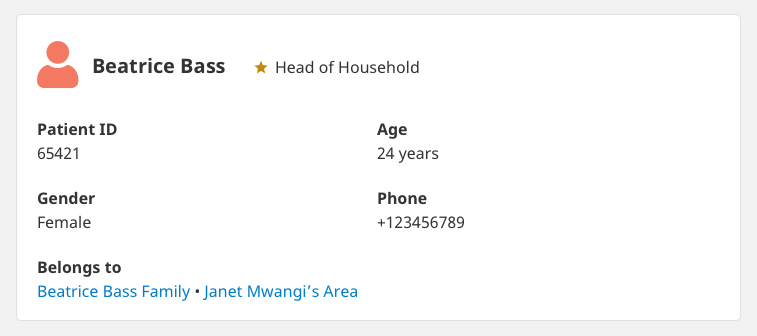
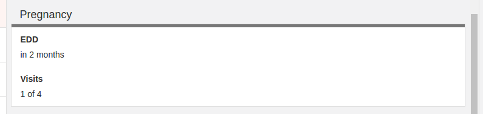

# Contact Summary

In the `app_settings.contact_summary` you can write a script to output fields for the contact info pane and help decide which reports should be able to be filed against a contact. The script is evaluated as JavaScript so all the standard language features are available.

## Inputs

There are several variables available to you to inspect to generate the summary information:

- `contact` which is the currently selected contact. This has minimal stubs for the `contact.parent`, so if you want to refer to a property on the parent use `lineage` below.
- `reports` which is an array of reports for the contact.
- `lineage` which is an array of the contacts parents (added in 2.13.0). `lineage[0]` is the parent, `lineage[1]` is the grandparent, etc. Each lineage entry has full information for the contact, so you can use `lineage[1].contact.phone` for example.
- `targetDoc` (added in `3.9.0`) which is the current `target`(https://github.com/medic/medic-docs/blob/master/development/db-schema.md#targets) document of the contact, hydrated with the config information of every target it contains a value for. If there is no target document available (for example when viewing a contact that does not upload targets), this value will be `undefined`. This value might also be `undefined` if the contact has not yet synced the current target document. 

## Outputs

The output of your script is an object with three properties:

### `fields`

An array of fields which summarize the contact and will be shown at the top of the contact pane.



### `cards`

An array of cards to show below the summary, each with their own header and arrays of fields.



### `context`

An object which is used to to encapsulate information about this contact. This is to passed to each forms `expression` to give more information to decide whether or not to show the form in the "New action" menu, and also passed to each xform which can then use the information in field calculations.


## Configuration

Each field is an object with the following properties:

- `label` is the translation key to be used for the label.
- `value` is the value to display.
- `width` is how wide out of 12 the field should be shown. Common values are 12 for full width, 6 for half width, or 3 for quarter width.
- `translate` (defaults to false) is whether or not to translate the value, eg: `{ label: "contact.sex", value: "label.male", translate: true }`
- `context` (optional) is for providing translation context for complex values.
- `icon` is the name of the icon to display beside this field which is defined through the Configuration > Icons page.
- `filter` (optional) is the name of the display filter to apply to the value, eg: `{ value: '2005-10-09', filter: 'age' }` will render as "11 years". 
Common filters are: `age`, `phone`, `weeksPregnant`, `relativeDate`, `relativeDay`, `fullDate`, `simpleDate`, `simpleDateTime`, `lineage`, `resourceIcon`. 
For the complete list of filters, and more details on what each does, check out the code in [`medic/webapp/src/js/filters` dir](https://github.com/medic/medic/tree/master/webapp/src/js/filters).

In 2.13.0 and later the configured function `return`s to supply the output as in the following example. Prior to 2.13.0 to return the result you needed to declare the object on the last line of the script.

### Example

```javascript
var cards = [];
var context = {};
var fields = [];

if (contact.type === 'person') {
  fields = [
    { label: 'patient_id', value: contact.patient_id, width: 3 },
    { label: 'contact.sex', value: contact.sex, width: 3 },
    { label: 'contact.age', value: contact.date_of_birth, width: 3, filter: 'age' },
    { label: 'Phone Number', value: contact.phone, width: 3, filter: 'phone' },
    { label: 'Notes', value: contact.notes, width: 12 },
    { label: 'contact.parent', value: lineage, filter: 'lineage' }
  ];
  var pregnancy;
  var pregnancyDate;
  reports.forEach(function(report) {
    if (report.form === 'pregnancy' || report.form === 'P') {
      var subsequentDeliveries = reports.filter(function(report2) {
        return report2.form === 'D' && report2.reported_date > report.reported_date;
      });
      if (subsequentDeliveries.length > 0) {
        return;
      }
      var subsequentVisits = reports.filter(function(report2) {
        return report2.form === 'V' && report2.reported_date > report.reported_date;
      });
      context.pregnant = true; // don't show Create Pregnancy Report button
      var edd = report.expected_date || report.fields.edd_8601;
      if (!pregnancy || pregnancyDate < report.reported_date) {
        pregnancyDate = report.reported_date;
        pregnancy = {
          label: 'label.pregnancy',
          fields: [
            { label: 'EDD', value: edd, filter: 'relativeDay' },
            { label: 'Visits', value: 'label.visits.of', translate: true, context: { count: subsequentVisits.length, total: 4 } }
          ]
        };
      }
    }
  });
  if (pregnancy) {
    cards.push(pregnancy);
  }
} else {
  fields = [
    { label: 'contact.place.id', value: contact.place_id, width: 12 },
    { label: 'Notes', value: contact.notes, width: 12 }
  ];
}

if (targetDoc) {
  var activityCard = {
    label: 'Activity this month',
    fields: [{
      label: 'Targets data last updated',
      value: targetDoc.updated_date,
      translate: false,
      filter: 'relativeDate',
      width: 12,
    }]
  };

  targetDoc.targets.forEach(target => {
    var value = target.value.total;
    if (target.type === 'percent') {
      value = (target.value.total ? target.value.pass * 100 / target.value.total : 0) + '%';
    }
    activityCard.fields.push({
      label: target.translation_key,
      value: value,
      width: 12,
      translate: false,
      filter: 'number'
    })
  });

  cards.push(activityCard);
}

return {
  fields: fields,
  cards: cards,
  context: context
};
```
