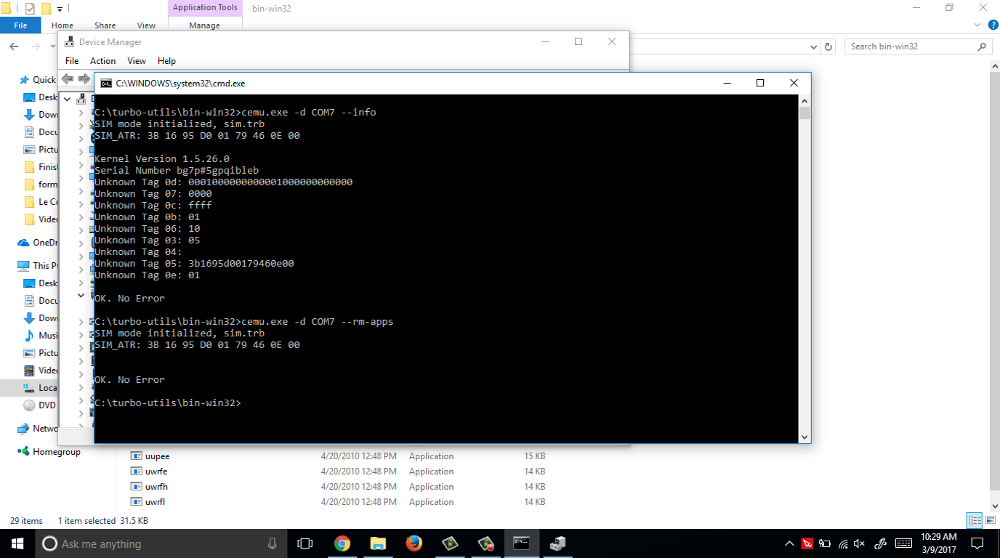
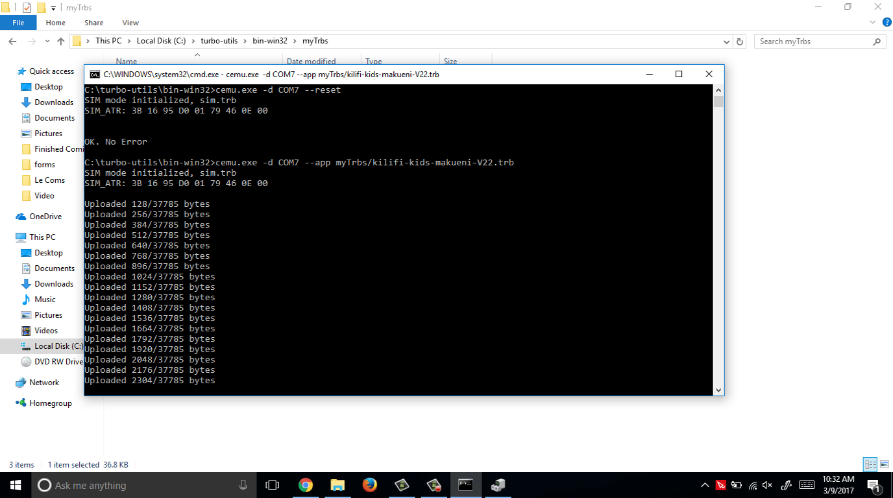

# Installing TRB files to Turbo Sim on Windows (4 easy commands)

- Download programming utilities from the bladox website [here](https://www.bladox.com/download.php?lang=cz#prog). 
- Unzip the archive and navigate to the `bin-win32` folder.
- Open the command line in that folder/Navigate to that folder in the commandline
- Connect your Bladox Programmer Board via USB to the computer
- Open the Windows Device manager([how?](https://www.lifewire.com/how-to-open-device-manager-2626075)) and locate the COM Number of the bladox board under `ports(COM & LPT)` in the below image it is `COM7`. We will use `COM7` for the commands below - substitute it with the one provided by your system.

- Run the following commands in order :
	- `cemu.exe -d COM7 --info`
	- `cemu.exe -d COM7 --rm--apps`
	- `cemu.exe -d COM7 --reset`
	- `cemu.exe -d COM7 --app myTrbs/trb-name.trb`
	
	
	
	
	
	
		- This command will start uploading the trb to the turbo sim like below
		
		- After it is finished you will see the below
    