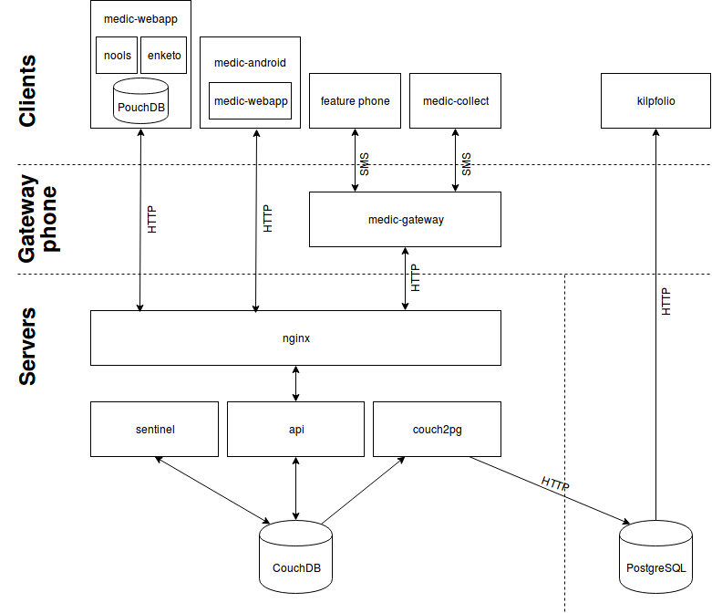

# Architecture of Medic Mobile instances

This page gives details on the different pieces of a Medic Mobile project, how they interact, and what they're used for.

## Overview

## Server side

### [CouchDB](http://couchdb.apache.org)

A free and open source NoSQL database we use to store all our data, configuration, and even the application code. CouchDB is really good at replication which is the process of sending the data to another database and back again.

### [api](https://github.com/medic/medic-webapp/tree/master/api)

A NodeJS service which runs on the server as a wrapper around CouchDB. It provides some security, auditing, and integration APIs. It also includes a custom implementation of filtered replication to allow it to support more concurrent users.

### [sentinel](https://github.com/medic/medic-webapp/tree/master/sentinel)

Another NodeJS service running on the server, sentinel performs actions called transitions every time a document in CouchDB is added or modified. Some examples are validations, generating scheduled messages, automatic responses, creating patients, and sending alerts.

### [PostgreSQL](https://www.postgresql.org)

A free and open source SQL database that we use for analytics queries for display in tools like klipfolio. We created a library called [couch2pg](https://github.com/medic/couch2pg) to replicate data from CouchDB into PostgreSQL.

### [nginx](http://nginx.org)

nginx proxies all requests to api and adds encryption and compression.

## Client side

### [medic-webapp](https://github.com/medic/medic-webapp)

This is the application that most users interact with. It's an [AngularJS](https://angularjs.org) single page responsive web application.

We use an offline first strategy which means the data is stored on the client and all pages can load immediately regardless of whether you have a fast connection, slow connection, or no connection at all. The data is stored in [PouchDB](https://pouchdb.com) which replicates changes back and forth in the background with the server CouchDB.

We use [Enketo](https://enketo.org) to render configured xforms and help with styling and dynamic elements such as show/hide and validation rules.

We use the [nools](https://github.com/C2FO/nools) rules engine to compute the upcoming tasks and monthly targets of the users.

### [medic-android](https://github.com/medic/medic-android)

The application works in the browser or wrapped in the medic-android app which allows for project branding, sets the project URL, and hides browser elements like the URL bar.

## Other applications

### [medic-gateway](https://github.com/medic/medic-gateway)

Medic Gateway is an android app for sending and receiving SMS messages. Each SMS enabled project has one gateway running. It polls an api endpoint to write incoming SMS into the CouchDB and retrieve outgoing SMS to send.

### [medic-collect](https://github.com/medic/medic-collect)

An android app based on [Open Data Kit](https://opendatakit.org) to render xforms on the phone and send reports in to medic-gateway over SMS or directly to api over mobile data.

### [medic-conf](https://github.com/medic/medic-conf)

A command line utility for uploading configuration and bulk importing of records.

### SimApp

A SimApp is a thin chip inserted under the SIM card and can be used to provide a menu for sending reports over SMS on feature phones. See [Tools for Basic Phones](http://medicmobile.org/tools).

### [medic-reporter](https://github.com/medic/medic-reporter)

A helper tool for sending reports directly to api for testing report submission without having to send an SMS through the gateway.
