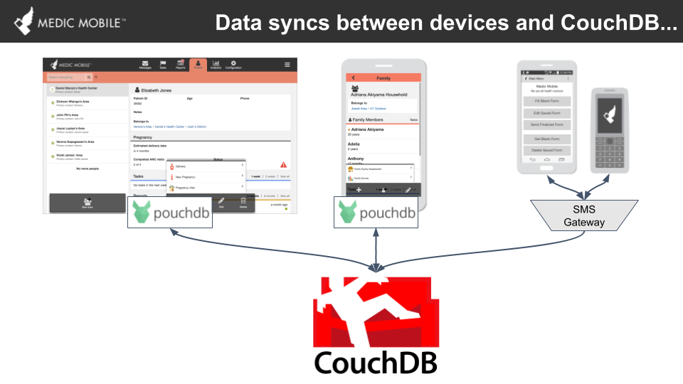
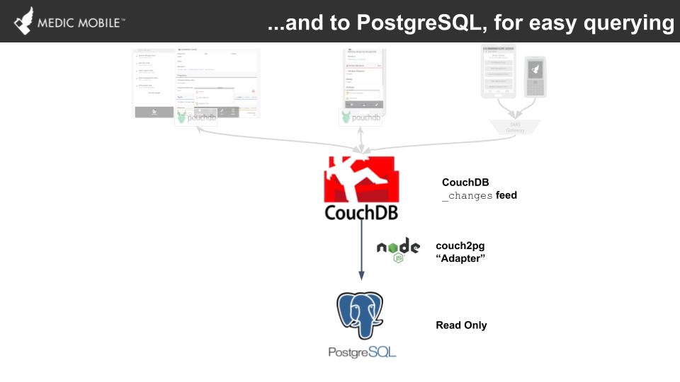
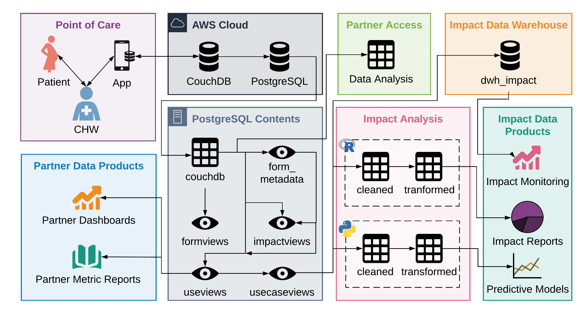

# Data flows

In this page we focus on how data flows through the various CHT components. CHT is built to support the delivery of quality community health in hardest to reach areas. It is therefore designed to work in areas with low connectivity making it an offline-first toolkit. The architectural and technology choices in the stack are mostly guided by this principle which will be evident in the discussion of the data management pipeline.

## Overview

At a high level:

- data is collected from the device of a health worker;
- this data is pushed to an online instance from where this data is available to other health workers, supervisors and decision makers;
- the data is transferred to a relational database and presented in forms suitable for analytics and visualizations;
- more access to the data is given to relevant parties at this level, for example analysts;
- managers and decision makers access the same from visualizations of the data.

## Detailed look at what happens at every level

The layout detailed here is specific to how Medic Mobile supports its partners at the moment. It is replicable and can be deployed as is or tweaked independent of Medic Mobile either by modifying or replacing pieces of it with other options.

### Current infrastructure

We look at this in three general classifications.

#### 1. Data collection

Data is collected at the point of the health worker interacting with the toolkit. These tools and their corresponding data stores are:-

- Mobile app -> PouchDB
- Webapp -> PouchDB / CouchDB
- Text forms / sms -> SMS gateway / SMS aggregator -> CouchDB

The mobile app and webapp, when deployed for offline first use, use a local database namely PouchDB. Similar to CouchDB, it is a document-oriented database. The data collected in PouchDB is synced to an online CouchDB upon the user connecting to the internet. Local storage is not applicable to SMS; instead, an [SMS gateway](https://github.com/medic/medic-gateway) or an [SMS aggregator](https://africastalking.com) is used to help get the data to an online CouchDB instance.

Ultimately all the data ends up in a CouchDB instance deployed in the cloud whether through data synchronization with PouchDB local to the health workers devices, use of SMS aggregators or gateway. It should be mentioned that you can have a deployment supported by all of webapp, mobile app and SMS and have all the data end up in the same CouchDB instance.

#### 2. Data transformation

We use a service called couch2pg to move data from CouchDB to a relational database, PostgreSQL in this case. The choice of PostgreSQL for analytics dashboard data sources is to allow use of the more familiar SQL querying. It is an open source tool that can be [easily deployed](https://github.com/medic/medic-couch2pg#installation-steps-if-applicable). When deployed the service uses [CouchDB's changes feed](https://docs.couchdb.org/en/2.2.0/api/database/changes.html) which allows capturing of everything happening in CouchDB in incremental updates. It is run and monitored by the operating system where it is configured to fetch data at a configurable interval.

Data copied over to PostgreSQL is first stored as raw json (document) making use of PostgreSQL's jsonb data type to create an exact replica of a CouchDB database. From this, default views are created at deployment of the service and refreshed during every subsequent run. Additional custom materialized views created later are also refreshed at this time.

Custom materialized views and functions are added specific to a deployment's needs. Generally the following naming convention is recommended:

- _formview_ as a view of raw forms
- _useview_ as a view of form data supporting a use case as defined by design
- _contactview_ as a view of people and places
- database functions are used as a way to join as much relevant data as possible for easier querying in analytics or dashboard visualizations.

Data in the views and functions mentioned in this section is as accurate as the accuracy of the SQL queries. Best practice is to begin the process of defining these objects at design in order to align analytics and dashboards requirements with workflows being deployed.

#### 3. Data use

The data in PostgreSQL is mostly either used by direct querying or via dashboard visualizations. Database visualizations are built scoped to the requirements of supporting a successful deployment. In-depth data analysis is supported at the PostgreSQL level through updated contactviews, formviews, useviews and functions with access to these provided to relevant parties as and when needed.

As mentioned previously, formviews are built to present data in a structure similar to the data collection tool (form) used. Useviews are tailored to align with a use case, mostly using the formviews are the data sources. These are fundamentally guided by design of the workflows and should be interpreted in the context of the design materials including a document explaining the definitions of variables used.

The objects present here are not limited to views and functions. Additional tables can be added, for example providing mappings or supporting operations external to the functions available in the toolkit. In short, there is no limitation to the utility that can be added this level to support analytics and dashboards. That said, measures are taken to ensure controlled access, reliability and timely access of the data by the various parties. Some of these measures are:

- roles and users allocation and deallocation done by specific roles within partner technical teams with support from Medic Mobile as needed;
- access control management is left to the partner technical teams where possible;
- dashboard data source refresh intervals set to align with project needs;
- update of the data sources monitored to ensure updating works as expected;
- review of the dashboards as part of the design process;
- qualitative design activities to interrogate trends observed in the dashboards and iterate on them if need be;

### Beyond current pipeline

[cht-core](https://github.com/medic/cht-core) is mostly data collection tools and is the first in the data management pipeline. It is the core part of a deployment but the rest of the tools can be easily replaced with other preferred options. It also helps that couch2pg is an open source tool which provides the opportunity for collaboration to extend its functionality to support other implementations. Klipfolio, the tool that we currently use for visualizations, is a proprietary tool but there exist open source options such as [Apach Superset](https://superset.incubator.apache.org/) that are worth exploring.

## Backup

The machines running each of CouchDB and PostgreSQL instances are backed up daily.

## Summary

The diagram below summarizes the details in the document.

