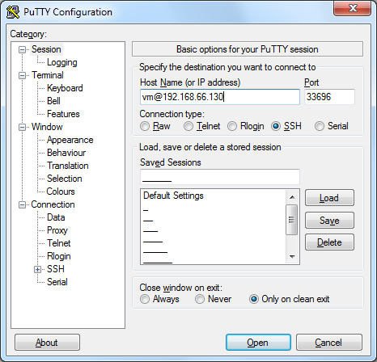
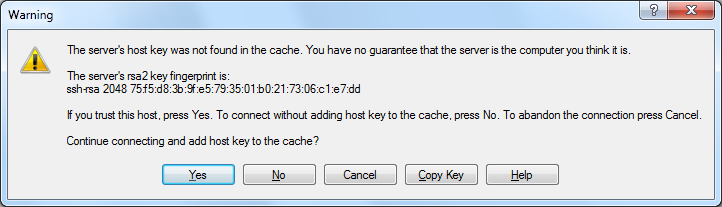
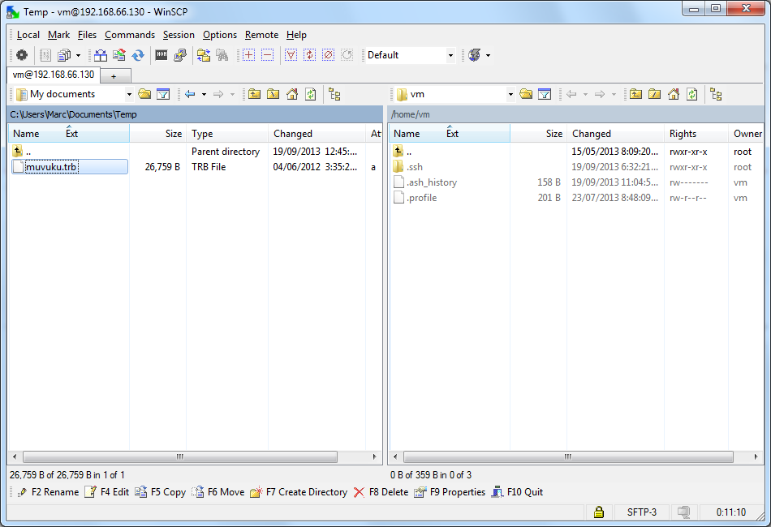
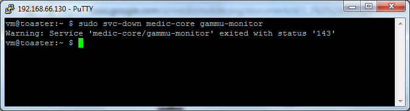
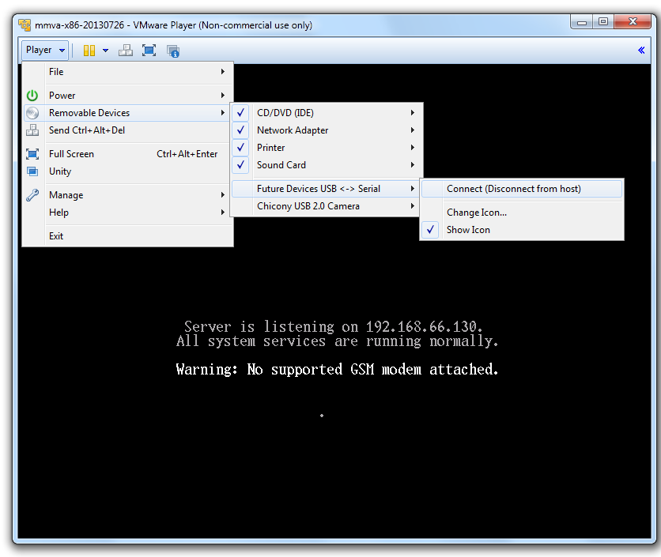
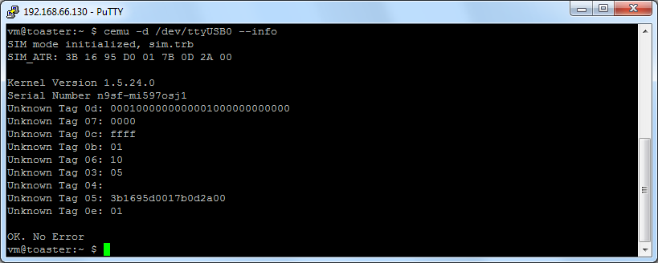
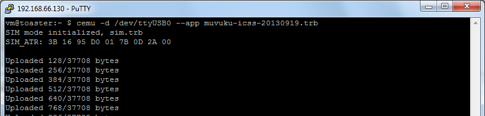

# Loading Medic Mobile SIM app on a Turbo SIM

This document will guide you through loading a SIM application onto the Turbo SIM parallel SIM hardware using Medic OS.

## Prerequisites

* A computer that can run VMware Player. *Directions below shown using a Windows computer*

* A Turbo SIM Programmer board connected to computer with USB cable.

* Turbo SIMs to program.

* Medic SIM application file. *Put this file on your computer or have the URL handy*

* A SIM card cut to use with a Turbo SIM. *Used only for programming board placement, does not have to be activated*

* VMware Player - download & install [VMware Player for Windows](https://my.vmware.com/web/vmware/free#desktop_end_user_computing/vmware_player/6_0) *Note that v6 runs on 32-bit computer, but v7 does not*

* Medic OS - download latest version from [http://dev.medicmobile.org/downloads/medic-os/latest/](http://dev.medicmobile.org/downloads/medic-os/latest/). *Only the 32 bit images should be used (Marked with x86) as the x64 version do not have the proper drivers*

* SSH application, such as [PuTTY](http://www.chiark.greenend.org.uk/~sgtatham/putty/download.html)

* SSH file transfer software - Directions below use [WinSCP](http://winscp.net/eng/download.php) but PSCP, PuTTY command line tool, can also be used. *If you have an internet connection and a URL for the Medic SIM app you may be able to skip this.*

## Prepare Medic OS

Setup the Medic OS on VMWare using the steps outlined [here](https://github.com/medic/medic-docs/blob/master/md/install/mmva-vmware.md): 

*When the VM is up and running normally you will see this screen.*

*Note: if you click into the virtual machine you will lose your mouse cursor. To get it back press `CTRL` and `ALT` simultaneously*

## Load Medic SIM app over SSH

### Open SSH Application

*Replace the IP with that of your Medic OS instance*

**Option 1:** Use the SSH terminal of your choice: `ssh vm@192.168.66.130 -p 33696` 

**Option 2:** Open SSH session in PuTTY:

**Option 3:** Open terminal window directly from WinSCP using Ctrl + P

### Get the Medic SIM app file on Medic OS

* **Option 1** if you have internet connection and URL for the Medic SIM app: Use your SSH terminal from the previous step to get file from the internet using `wget`. *Replace the URL with the one that you have for the Medic SIM app* 

`wget http://dev.medicmobile.org/downloads/medic-simapp/medic-simapp.trb`

* **Option 2** if you have Medic SIM app on your computer: Use the WinSCP application to transfer it to the Medic OS

### Connect the Turbo SIM Programmer Board

Before connecting the device you must run this command In PuTTY: 

`sudo svc-down medic-core gammu-monitor`

Plug the TurboSIM Program Board to the computer using the USB cable. Wait for the usb drivers to install, then connect the device to the Medic OS as follows using the Removable Devices in the Player menu.

Put the SIM and Turbo SIM together in the SIM holder. Hold the SIM down with a clip.

### Check firmware version

Check the Turbo SIM version: `cemu -d /dev/ttyUSB0 --info`

If firmware version is less than 1.5.24 you need to flash the firmware.

1. Get the firmware: `wget https://github.com/medic/bladox-macosx/blob/master/kernels/kernel-TSIM-1.5.24.bin`

2. Flash the firmware onto the Turbo SIM: `btldr -d /dev/ttyUSB0 -s kernel-TSIM-1.5.24.bin`

*Wait until the flashing is complete before removing the Turbo SIM. This process can take over four minutes, during which the LED may light up, but may also stay off for up to 50 seconds.*

### Remove all previous installed applications

`cemu -d /dev/ttyUSB0 --reset`

### Install Medic SIM app

`cemu -d /dev/ttyUSB0 --app medic-simapp.trb`
*Replace `medic-simapp.trb` with the appropriate name of your SIM app file.*

…

## Command Summary

**Before connecting programmer board:**

`sudo svc-down medic-core gammu-monitor`

**Obtain the SIM app file:**

`wget http://dev.medicmobile.org/downloads/medic-simapp/medic-simapp.trb`

**Load each Turbo SIM as follows: **

- Place new Turbo SIM in programmer

- Paste the three lines together into PuTTY:

`cemu -d /dev/ttyUSB0 --info`

`cemu -d /dev/ttyUSB0 --reset`

`cemu -d /dev/ttyUSB0 --app medic-simapp.trb`

**If the version is less than 1.5.24, upgrade the Turbo SIM, then load app again:**

`wget https://github.com/medic/bladox-macosx/blob/master/kernels/kernel-TSIM-1.5.24.bin`

`btldr -d /dev/ttyUSB0 -s kernel-TSIM-1.5.24.bin`

**To see files in a directory**

`ls -l`
