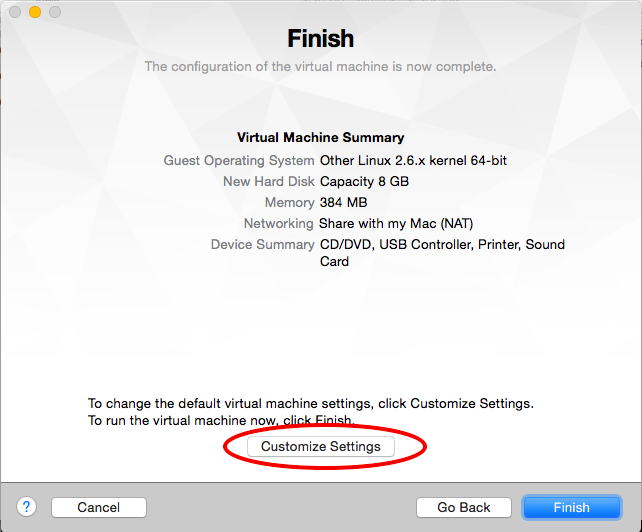
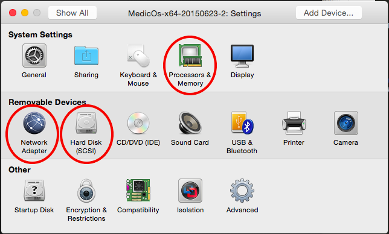
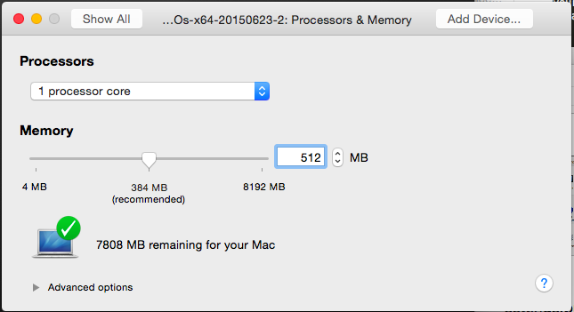
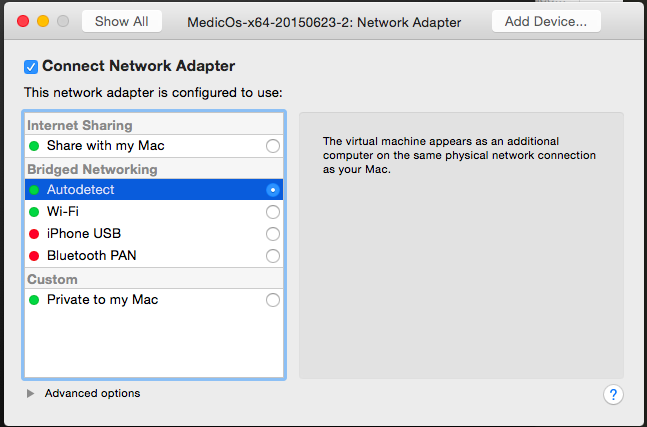
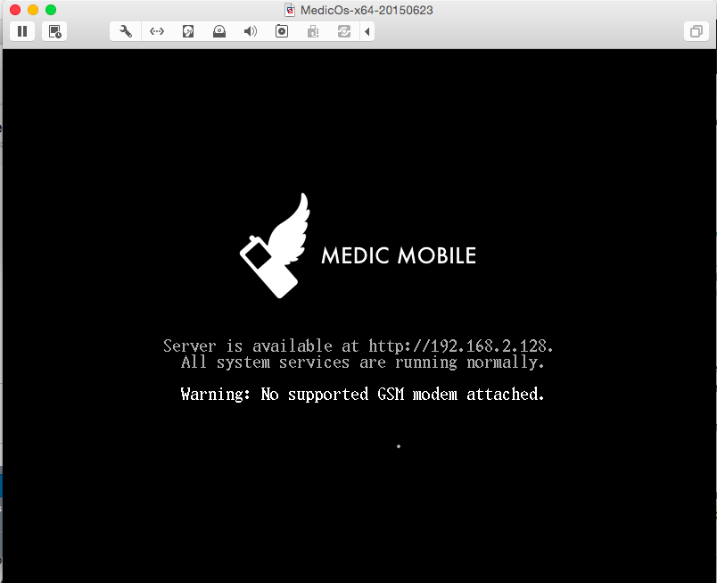
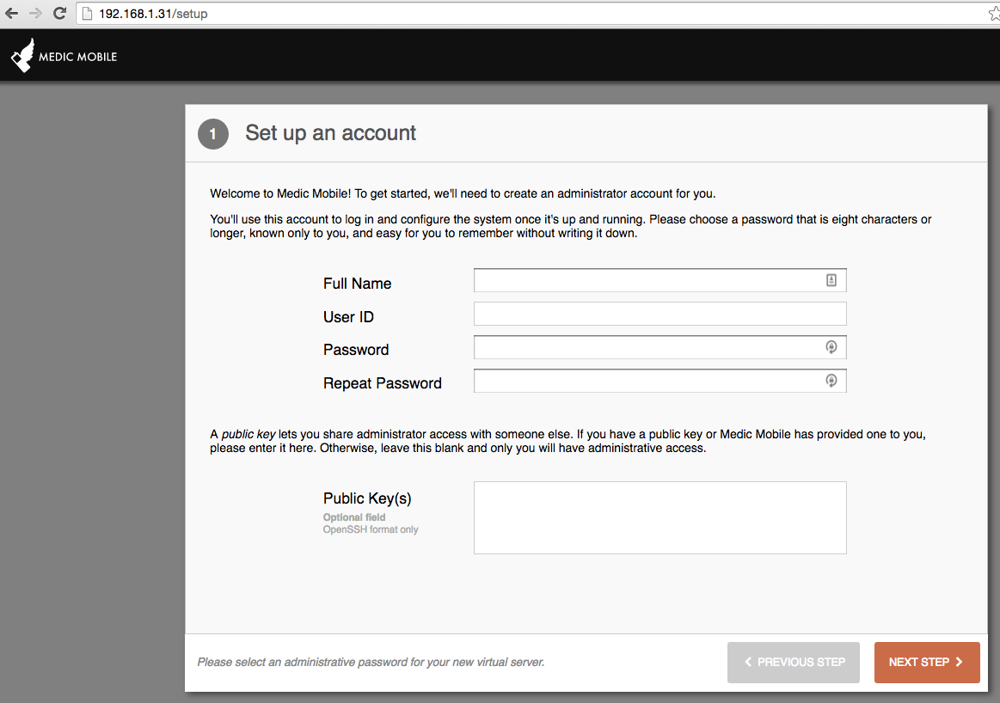

# Virtual Appliance Install with VMWare Fusion

This document will take you through the recommended steps to install the
the Medic Mobile Virtual Appliance. Instructions are for MacOS, but should be similar on other OSes.

Note : this was tested for MedicOS 64-bit version only (file names containing x64), on MacOS 10.10.

## Download the ISO

* Download the [latest bootable ISO image](http://dev.medicmobile.org/downloads/medic-os/).
Note : this was tested for MedicOS 64-bit version only (file names containing x64), on MacOS 10.10.

* Move it out of the downloads folder, give it a permanent home in your file
  structure.  The virtual machine will need to reference it on boot.

## Install VMWare Fusion

### Download

1. Go to the [VMWare Player Products](http://www.vmware.com/products/fusion/) page.
2. Download and install the latest version for your operating system. It's free for 30 days, then you need a paying license.

## Create New Virtual Machine

* Once installed, launch VMWare Fusion.
* On the launch screen choose Create New Virtual Machine

* Double-click Install from disk or image.

### Select Bootable ISO file

* Click Use another disc or image, and select your ISO file. Or use an existing one if you've done this procedure before.

### Select Linux OS

* For medicOS x86, select Other Linux 2.6.x kernel. For medicOS x64, select Other Linux 2.6.x kernel 64-bit.

### Customize settings and name your VM

* Click Customize settings, and when prompted select a directory where to save your virtual machine. Name it anything you want. Typically something like medicos-x64-20150623 is useful (with values corresponding to the .iso file that you used).

* You are now in Settings. You can also reach this page from the top-bar Apple menu, at Virtual Machine > Settings...

We'll be editing 3 settings.

### Specify 64G of maximum disk capacity

The VM will only use as much space as it needs, and if it uses the limit you
can easily adjust it.  You should create a maximum so the host operating system
is not affected if the VM fills up.

* Go to Hard Disk, and fill in 64GB of disk.

* Go to Show all to go back to Settings.

### Change memory setting

We recommend a minimum of 512MB of RAM for the VM. The VM will only use what it
needs, but having a limit keeps the the host operating system performance from
degrading.

* Go to Processors and Memory and select 512MB.

* Click Apply. Go to Show all to go back to Settings.

### Use Bridged Networking

This allows the local network to access the VM. In our typical setup we want to
connect to the IP with SMSSync.

* Select Network Adapter, and Bridged Networking: autoselect. If you leave the default, Internet Sharing: Share with my Mac, the VM will be able to access the internet but other computers on the network will not see the VM.

## Setup Medic VM

### Click Play

Click the big play button on the VM's window, or in the Virtual Machine Library window.

On first run the VM will do some software copy and setup. You should immediately see progress messages changing, like "Setting up software (32%)...".

When the VM is up and running normally you will see this screen.

### Set a password to secure the virtual machine.

Navigate to the IP address in your browser and fill in the form.

Copy the password down somewhere safe so you don't lose or forget it.

Great, your VM is running!

Next: [Install some apps](garden.md)
