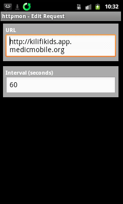
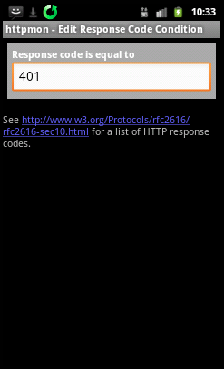

Instructions for using httpmon (
[google play](https://play.google.com/store/apps/details?id=org.jtb.httpmon), 
[medic mobile](http://dev.medicmobile.org/downloads/monitoring/ManageMonitorsActivity-debug.apk),
[source code](https://code.google.com/p/httpmon/)
) for monitoring the connection of a Medic Mobile instance.

We will configure httpmon to check the HTTP response code on a specific URL
every 60 seconds and send an SMS to a configured phone number if that test
fails.

- Add a monitor, give it a name like "local" or maybe the laptop name if Medic
  Mobile is running locally or use the project name.

- Edit the URL to specify your server address, e.g. http://192.158.2.19 or
  http://myproject.app.medicmobile.org.  The server  URL should be the same one that is used for the sync URL in SMSSync, since that's the address that needs to be reachable.

- Add a condition to check that the HTTP response code is 401.  This just tests that the auth prompt is returned.

- Add an action to send a txt message if this test fails.

Once this is setup start the monitor.  You should see a green plus on the httpmon home screen for that monitor.

Then do  a test to see if the notification works. Shutdown the VM or disconnect
the laptop from wifi for example and wait a minute since it checks every minute
and you should receive an SMS alert from httpmon.

To edit do a long tap on the conditions entry/line then choose edit.

Conditions: HTTP response code is: 401

Action is send message and you can tweak the 15 minute alert if it gets
annoying, it should continue alerting you every 15 minutes if the connection is
severed/broken (the test fails).

Also enable Start at Boot

You can add multiple tests and notifcations so more than one person can be
alerted if necessary.

Do a reboot of the phone for good measure and check to see httpmon is
monitoring maybe do one more failure test for good measure.

