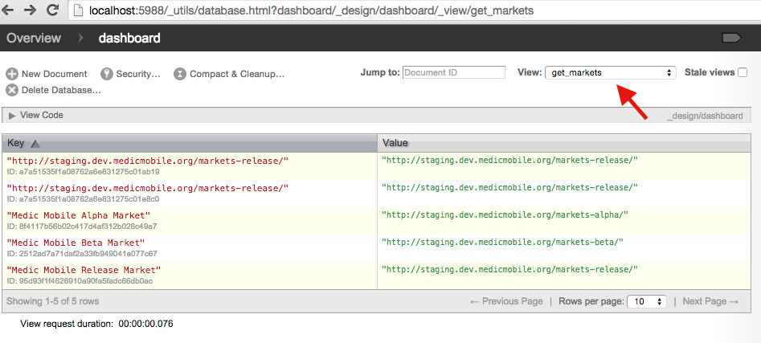

# How to Migrate Dashboard to a Different Market

Sometimes you want to update the market that your installation is pointing to.
For example if you installed the stable or beta release and want to switch to
alpha.

## SSL switchover

On Feb 17, 2015 the staging server or market/release server was changed to
SSL-only (https). This means redirects were setup for the non-SSL (http) port
80.  Unfortunately the dashboard does not support redirects at the time of the
change so if you have a local development or testing install, or a DIY install
then you have to update the dashboard install and market documents to use SSL
(https) to get any updates.

## Shell Script

The fastest way to migrate if you are running Unix or have a virtual machine
with Unix you can download and execute the [update_markets.sh
](https://raw.githubusercontent.com/medic/medic-data/master/scripts/update_markets.sh)
shell script.

```
sh update_markets.sh
```

## Manually

If the shell script is broken or you can't run it, these instructions are
equivalent using Futon. Note: Login to Futon with admin privileges.

First navigate your installation to the get_markets index in Futon.  There you
will see a list of documents, edit each document by clicking on the row or ID
field in the list.

```
http://192.168.3.10/_couch/_utils/database.html?dashboard/_design/dashboard/_view/get_markets
```



To update the markets to use SSL edit and replace instances of 'http' with 'https'.

To modify the market your dashboard is subscribed to you will need to modify any URLs to reference your desired market.  The following is how are releases are mapped to URLs:

    Release: market/_db, market-release
    Beta: market_1/_db, market-beta
    Alpha: market_2/_db, market-alpha

After you're done editing don't forget to Save Document in the top menu bar.


