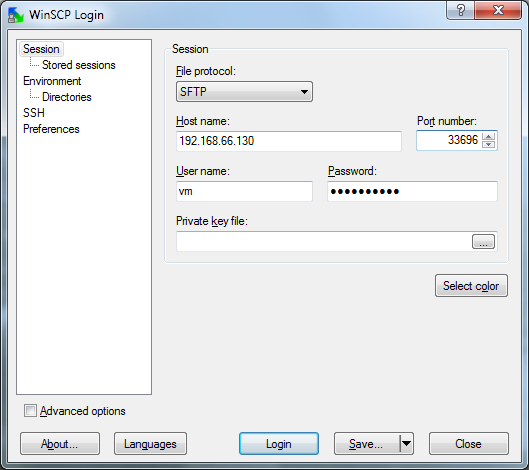
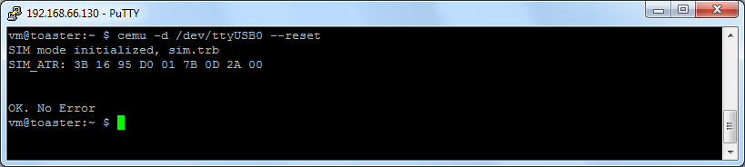
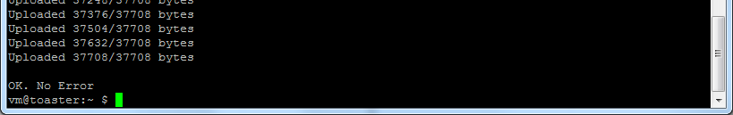

Loading Medic Mobile SIM app on a Turbo SIM

Prepared September, 2013 by [Marc Abbyad](mailto:marc@medicmobile.org)

Updated March, 2015 by Henok and Marc

[[TOC]]

## Requirements

* VMplayer - download & install [VMware Player and VMware Player Plus for Windows](https://my.vmware.com/web/vmware/free#desktop_end_user_computing/vmware_player/6_0)

* Medic OS - download latest version from [http://dev.medicmobile.org/downloads/medic-os/latest/](http://dev.medicmobile.org/downloads/medic-os/latest/) - Only the 32 bit images should be used (Marked with x86)

* WinSCP - download and install [WinSCP](http://winscp.net/eng/download.php) 

* SSH Application, such as [PuTTY](http://www.chiark.greenend.org.uk/~sgtatham/putty/download.html)

* *Turbo SIM Programmer board with USB cable*

* *Turbo SIMs to program*

* *Any computer that can run VMware Player*

## Prepare Medic OS

Setup the Medic OS on VMWare using the steps outlined [here](https://github.com/medic/medic-docs/blob/master/md/install/mmva-vmware.md): 

*When the VM is up and running normally you will see this screen.*

Note: if you click into the virtual machine you will lose your mouse cursor. To get it back press CTRL+ALT

## Get the Medic SIM app file on Medic OS

* Option 1 if you **have **the .trb file: Use the WinSCP application to transfer it to the Medic OS

* Option 2 if you **do not have **the .trb file on your computer: Use PuTTY  to log into Medic OS and get file from internet using: 

wget http://dev.medicmobile.org/downloads/medic-simapp/medic-simapp-20130919.trb

or to put it in persistent storage:

cd /srv

sudo wget http://dev.medicmobile.org/downloads/medic-simapp/medic-simapp-20130919.trb

## Load Medic SIM app over SSH

### Open SSH Application

Option 1: use the SSH terminal of your choice: **ssh vm@****192.168.66.130** (NOTE:  Replace the IP with that of your Medic OS instance)** -p 33696**

Option 2: open terminal window directly from WinSCP using Ctrl + P

Option 3: open Session in PuTTY:

### Connecting the Turbo SIM Programmer Board

Before connecting the device you must run this command In PuTTY: 

sudo svc-down medic-core gammu-monitor

Plug the TurboSIM Program Board to the computer using the USB cable. Wait for the usb drivers to install, then connect the device to the Medic OS as follows using the Removable Devices in the Player menu.

Put the SIM and Turbo SIM together in the SIM holder. Hold the SIM down with a clip.

### Ensure that the Turbo SIM is running the right firmware version

cemu -d /dev/ttyUSB0 --info

Make sure that the firmware version is 1.5.24 or 1.5.26 (if not do steps at end of doc)

### Remove all previous installed applications

cemu -d /dev/ttyUSB0 --reset

### Install Medic SIM app

cemu -d /dev/ttyUSB0 --app medic-simapp.trb

cemu -d /dev/ttyUSB0 --app medic-simapp-20130919.trb

…

## Flashing the Turbo SIM (Only if firmware version is less than 1.5.24)

You can check the turbo sim firmware version with the following command

cemu -d /dev/ttyUSB0 --info

If it is below 1.5.24 then you must flash the Turbo SIM firmware to the newer version.

To do so you must first obtain the file *kernel-TSIM-1.5.24.bin* from the kernels directory of the medic/bladox-macosx GitHub project. ([direct link](https://github.com/medic/bladox-macosx/blob/master/kernels/kernel-TSIM-1.5.24.bin)) Put it in the /srv directory to ensure that it is there after you reboot the virtual machine.

cd /srv

sudo wget https://github.com/medic/bladox-macosx/blob/master/kernels/kernel-TSIM-1.5.24.bin

Once you have the first you can then load it onto the Turbo SIMs with the following command:

btldr -d /dev/ttyUSB0 -s /srv/kernel-TSIM-1.5.24.bin

Wait until the flashing is complete before removing the Turbo SIM. This process can take over four minutes, during which the LED may light up, but may also stay off for up to 50 seconds.

 

## Command Summary (using ICSS file as an example)

**Before connecting programmer board:**

sudo svc-down medic-core gammu-monitor

**Obtain the medic-simapp-XXXXXXXX.trb ****file:**

cd /srv

sudo wget http://dev.medicmobile.org/downloads/medic-simapp/medic-simapp-20130919.trb (broken example link)

**For each Turbo SIM load as follows: **

- place new Turbo SIM in programmer

- paste the three lines together into PuTTY:

cemu -d /dev/ttyUSB0 --info

cemu -d /dev/ttyUSB0 --reset

cemu -d /dev/ttyUSB0 --app /srv/medic-simapp-20130919.trb

**If the version is less than 1.5.24, upgrade the Turbo SIM, then load app again:**

cd /srv

sudo wget https://github.com/medic/bladox-macosx/blob/master/kernels/kernel-TSIM-1.5.24.bin

btldr -d /dev/ttyUSB0 -s /srv/kernel-TSIM-1.5.24.bin

**Change directory to /srv**

cd /srv

**See files in a directory**

ls -l

