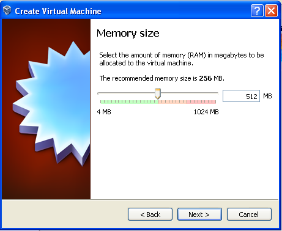
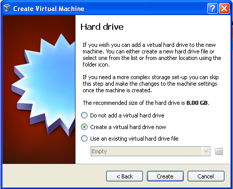
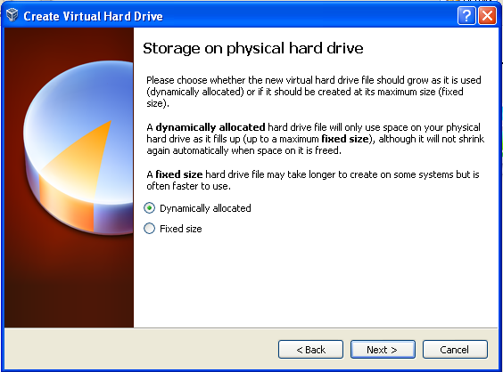
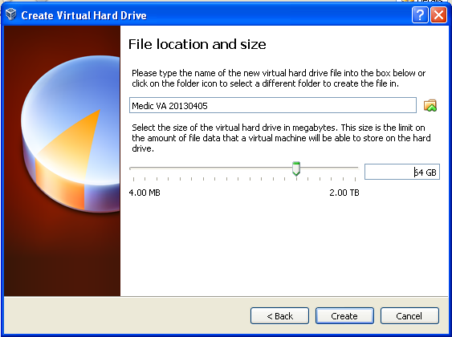
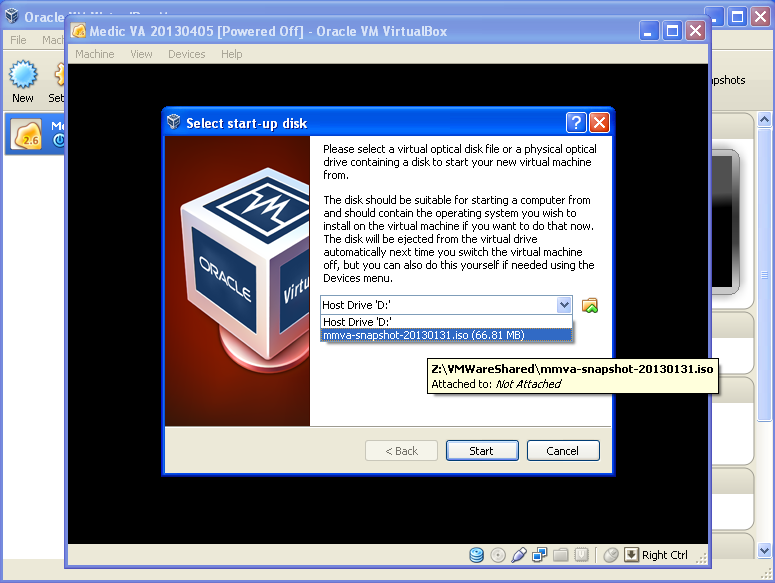
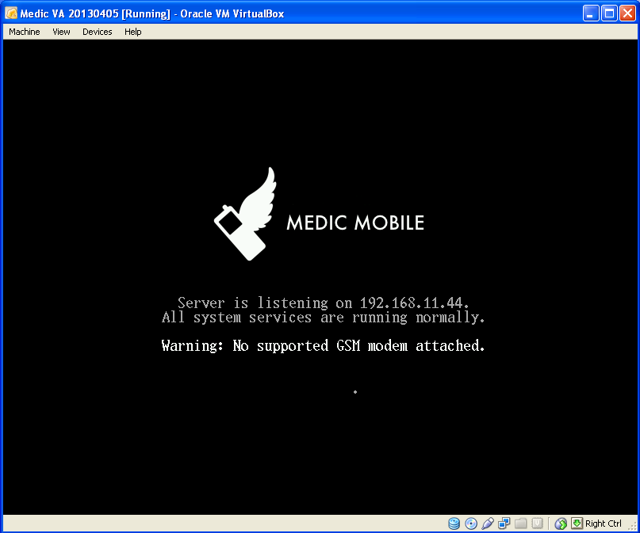

# Virtual Appliance Install with Virtual Box

This document will take you through the recommended steps to install the 
the Medic Mobile Virtual Appliance.

## Download the ISO

* Download the [latest bootable ISO image](http://dev.medicmobile.org/mmva/mmva-x86-current.iso).

* Move it out of the downloads folder, give it a permanent home in your file
  structure.  The virtual machine will need to reference it on boot.

## Install Virtual Box

### Download 

1. Go to the [VirtualBox Downloads page](https://www.virtualbox.org/wiki/Downloads).
2. Download and install the latest version for your operating system.

## Create New Virtual Machine

* Once installed, launch VirtualBox
* On the launch screen choose New button Virtual Machine

### Set Name and OS

The name used here is a convention you can name it anything you want.  

* Choose Linux for Type
* Choose Linux 2.6 for Version
* Choose Next

### Set Memory Size

We recommend reserving at least 512M of memory for the virtual machine.

### Create Virtual Hard Drive

* Choose Create a virtual hard drive now (default)
* Choose Create

* Choose VDI (default)
* Choose Create

* Choose dynamically allocated (default)
* Choose Next

* Set file size to at least 64 GB
* Choose Create

### Bridged Networking

To allow external devices to access the VM from the host's network use bridged network mode.  This will allow the same network address used on the host system to be uesd on the virtual machine.

* Select the VM instance in the right column
* Choose Settings icon at the top

* Select Network in right column
* Select Bridged Adapter in Attached to dropdown
* Select OK

The following step is **optional**.  Change the adapter type to the network adapter you want the VM to use.  For example if you have two network adapters, one for wired and one for wireless, you might need to change this option to have the VM use the right network.

* Choose Advanced
* Choose correct adapter

### Start

Once the VM is configured the configuration screen should look something like this.

* Choose Start

Now choose the startup disk, here we use the ISO file you downloaded earlier.

* Choose the folder icon next to the dropdown
* Navigate to the ISO file
* Click Start to launch the new VM

The VM should take a few seconds (30-60) to start the first time since it needs to do some setup.  Once it's done you should see a screen similiar to below.

### Set a password to secure the virtual machine.

Navigate to the IP address in your browser and enter a password twice into the form.

Copy the password down somewhere safe so you don't lose or forget it.

Great, your VM is running! 

Next: [Install some apps](garden.md)
