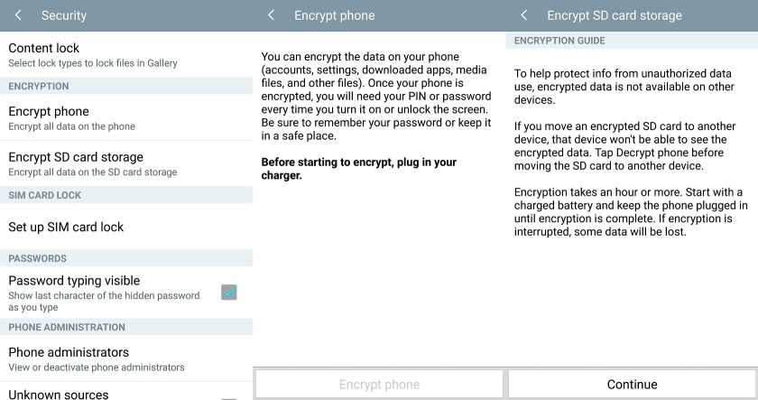
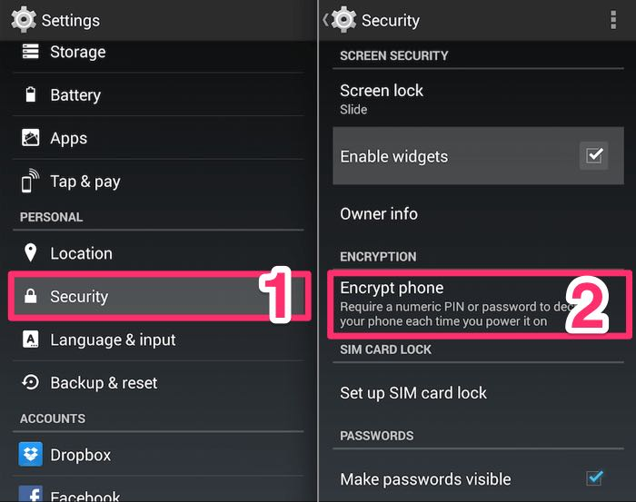

# Securing Android devices

## PIN Setup and Disk Encryption

### Android 6.0 or later

Disk encryption should be automatic for these versions of Android.

To verify that the device is encrypted, navigate
to `Settings` `>` `Personal` `>` `Security`, and verify that encryption is on.
Then, navigate to `Settings` `>` `Security` `>` `Screen Lock` and ensure that
a numeric PIN is set.

### Android 5.0 or later

Open the `Security` menu under settings. On unmodified versions of Android, this
can be found under `Settings` `>` `Personal` `>` `Security`. Choose `Encrypt
Phone`, `Encrypt Tablet`, or `Encrypt Device`. If you haven't already set a PIN
or passcode for the lock screen, you will be prompted to do so. Remember this
PIN and do not write it down.

### Android 4.4 or earlier

First, you'll need to set up a PIN. Navigate to `Settings` `>` `Security` `>`
`Screen Lock`, and set a numeric PIN for the device of *at least* four digits.
Remember this PIN and do not write it down.

Then, open the `Security` menu under settings. On unmodified versions of
Android, this can be found under `Settings` `>` `Personal` `>` `Security`.
On some devices, the exact menu layout may have been modified by the hardware
manufacturer. Choose `Encrypt Phone` or `Encrypt Tablet`.

### Android Versions before 3.0

Android does not support disk encryption in versions earlier than 3.0
(Honeycomb). If you have one of these devices, do not use it.

## Parking lot

TODO: instructions on how to secure an android device:

 - disk encryption
 - pincode / password
 - remote wiping
 - possibly discuss scenarios, explain how our data is stored and what that means (ie we store data unencrypted, anyone who can access the phone can pull of PHI etc)

