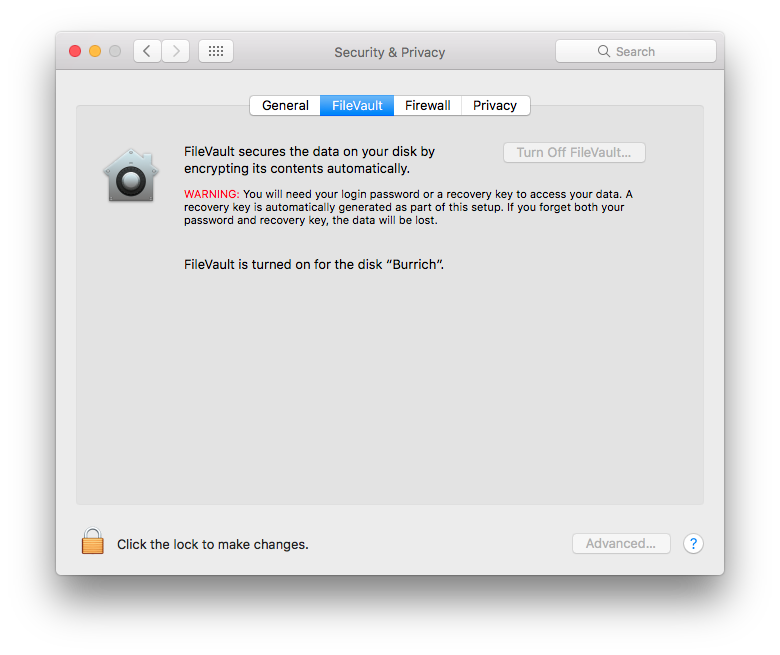

# Securing Computers

To secure a computer you should enable FDE (full disc encryption) on the device.

## Windows

## MacOS

It is likely that FDE is already enabled. To check, navigate to System Preferences -> Security & Privacy, and click on the FileVault tab.

If it is not enabled, enable it by following the instructions on the page. This will take a long time to complete.

## Linux

TODO: fill this in

 - How to encrypt a Windows computer
 - Same for Linux and MacOS (why not, they're easy)
 - How to password protect these computers
 - Possibly a discussion (either here or linked from [Securing Android devices](securing-android-devices.md)) on how data gets stored etc
