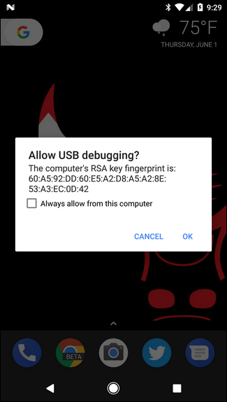
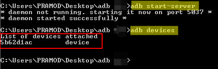

With Android 4.1 (aka Jelly Bean) and upwards the full system log is only visible if you have root.  
To get logs, you have to use `adb logcat` via a computer.

These are the instructions for getting logs using adb:
1. Download adb for the below platforms
- [windows](https://dl.google.com/android/repository/platform-tools-latest-windows.zip)
- [Mac](https://dl.google.com/android/repository/platform-tools-latest-darwin.zip)
- [Linux](https://dl.google.com/android/repository/platform-tools-latest-linux.zip)
2. Copy zip to folder and extract it
3. Navigate to the folder you have extracted it to. You should see files like adb, AdbWinApi, etc1tool etc. Open the Command prompt/terminal in the current folder(In Windows, press Alt + D and write 'cmd')
4. Enable USB debugging on your phone by going to Settings > Developer Options > USB Debugging (this varies from phone to phone, check on the internet if the phone doesn't fit this)
5. Connect your phone by USB to the computer
6. You will see a popup : "Allow USB debugging. The computer's RSA fingerprint.....". Click OK

7. Open the command which was opened previously and write the following command: `adb start-server`
8. To check if your phone is properly connected, write the command `adb devices`. This will list the devices connected. Something like 

 
 
9. Followup with command: `adb logcat > gateway.txt`
10. Now it is ready to take android logs. This is the time to to try to reproduce the error. 
Check some of the messages that are 'WAITING' and click retry
Do this for as many times as you deem necessary to capture logs for that event.
Wait about 15 minutes to enable capture of sufficient android device environment logs
11. Disconnect the phone from the computer
12. Open the folder which has the adb executable, you will see a file called gateway.txt
Send that file to the concerned person(PM or techlead)
