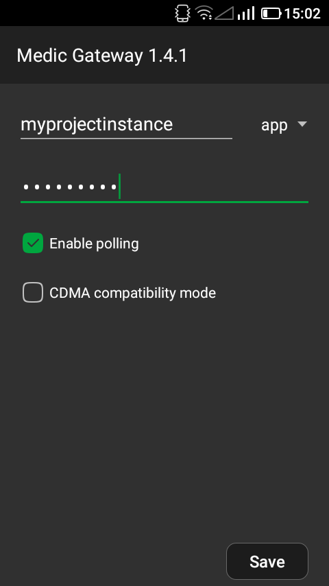
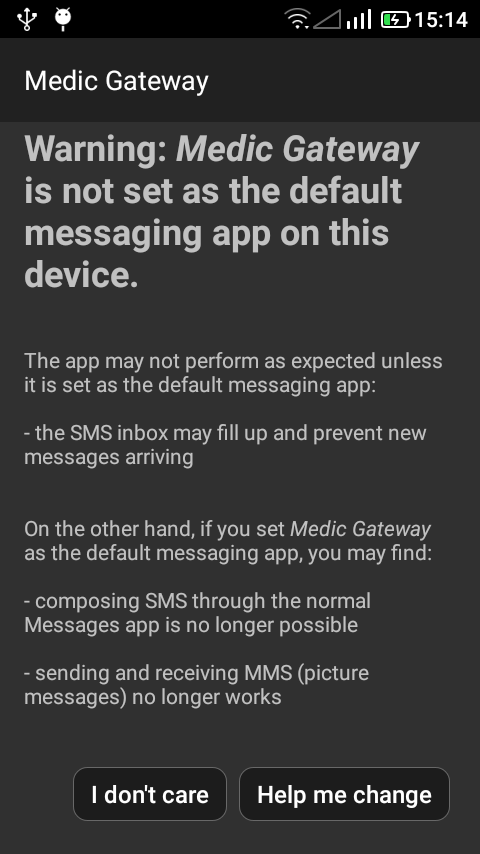

# Guide to troubleshooting Gateway problems

In a technical heaven, we would have immeadiate physical access to gateway phones, but alas, most of the time we have to hand them over to the partner. Fortunately, here comes this guide which is an easy step-by-step roadmap on debugging gateway problems.

Follow the steps as below (if you don't have physical access to the phone, switch steps 1 and 2)

1. - Make sure that the device is:
        i). Connected to the internet. You can check this by opening any Browser app in the phone and going to `https://google.com`.
        
        ii). Check if the instance name, instance type and `gateway` user password are set correctly in the Gateway `Settings` app screen.
        
        
        iii) Has the latest Gateway version. Get the latest version by opening the Google Playstore, searching for `Medic Gateway` and updating the existing app
        
        iv). Medic Gatway is set as the default app for SMS. To check if it is not, go to `Settings` in the Gateway app. If not the default, you will be met with the below app screen. In that case, click `Help me change` - after which composing or reading messages through the normal app will not be possible
        
        
        v). If messages are not going through to the server, in the `To Webapp`  tab, select some of them and press `Retry` at the bottom and wait for about 5-10 minutes.
        
        vi). If messages are not going through to the users, in the `From Webapp`  tab, select some of them and press `Retry` at the bottom and wait for about 5-10 minutes.  
        
        vii) In CDMA networks, there are some operator issues where messages get to the users in chunks of around 160 characters when the message is too long. If this is the case, go to `Settings` in the gateway screen and make sure you tick `CDMA compatibility mode`
        
        viii). Check if the phone has adequate free space
        
        ix) Restart the phone if no solution seems to work. Resetting the Adroind state sometimes resolves some persistent problems 

2.  When attacking the problem from the phones end does not work, move on to the server and try to solve it from there. Maybe the server has a configuration issue which hinders the processing or the acceptance of the messages by `Medic-Api`
Follow the steps:
   - navigate to `/srv/storage/gardener/logs/ `
   - perform `ls -lt` to arrange the log files in order of modified date. Note the concerned file which was last modified on the date you are investigating 
   - Pipe it to grep to get only SMS logs e.g `cat medic_medic_medic-api4.log | grep api/sms`. As below, note the errors and work from there.
```
cd /srv/storage/gardener/logs/   
ls -lt   
cat medic_medic_medic-api4.log | grep api/sms
```
> If the above steps don't yield the problem, get the Android logs using the steps outlined in the doc [in this link](https://github.com/medic/medic-docs/blob/master/troubleshooting/get-android-logs.md), note the make/model/android version their gateway handset is and escalate with those details to the PM/project techlead.


